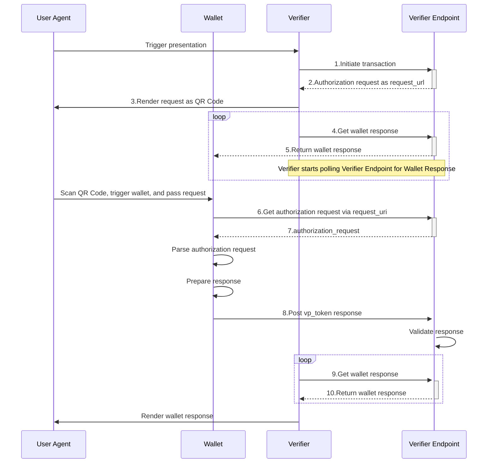

# Cross Device Presentation Flows

## Sequence



## Request / Response parameters

### 1.Initiate transaction

The Verifier sends a request to the Verifier Endpoint to start a VP presentation flow.
The `type` parameter must be set to `vp_token`, and the `presentation_definition` should contain a JSON object as specified in the [authorization request section of OpenID for Verifiable Presentations](https://openid.github.io/OpenID4VP/openid-4-verifiable-presentations-wg-draft.html#section-5.1).
The `ephemeral_ecdh_public_jwk` parameter is required; if not provided, an error will occur.

(For other request parameters and `type` specifications other than `vp_token`, please refer to the [link](https://github.com/eu-digital-identity-wallet/eudi-srv-web-verifier-endpoint-23220-4-kt?tab=readme-ov-file#initialize-transaction-endpoint))

URL:https://verifier-backend.eudiw.dev/ui/presentations
Method: POST
Parameters:

```json
{
  "type": "vp_token",
  "presentation_definition": {
    "id": "32f54163-7166-48f1-93d8-ff217bdb0653",
    "input_descriptors": [
      {
        "id": "eu.europa.ec.eudi.pid.1",
        "name": "EUDI PID",
        "purpose": "We need to verify your identity",
        "format": {
          "mso_mdoc": {
            "alg": ["ES256", "ES384", "ES512", "EdDSA"]
          }
        },
        "constraints": {
          "fields": [
            {
              "path": ["$['eu.europa.ec.eudi.pid.1']['family_name']"],
              "intent_to_retain": false
            }
          ]
        }
      }
    ]
  },
  "nonce": "6d6baccc-1320-409d-af9b-85b78ad26b45",
  "ephemeral_ecdh_public_jwk" :"{
      'kty': 'EC',
      'x': 'ODhL-OY1pZC9m4n4sR8AcBkR6WR9Flf-auV62TfjCpw',
      'y': 'WViWpkI_U7eGs73bcEnb52LHCwJ9bUu121-ZOBfb6II',
      'crv': 'P-256',
      'kid': '48ca2b34-4133-46c9-997a-91a28383e435',
      'use': 'enc',
      'alg': 'ECDH-ES'
    }"
}
```

### 2.Authorization request as request_url

The Verifier Endpoint returns a URL that the Verifier can use to request an authorization request.
The `presentation_id` is used later when the Verifier requests the vp_token from the Verifier Endpoint after the VP presentation flow completes.
The `request_uri` is used when the Wallet requests the authorization request from the Verifier Endpoint.

Parameters:

```json
{
  "client_id": "verifier-backend.eudiw.dev",
  "presentation_id": "OGewsqiKurZ-FZL-8LXmG4fQa-7y3LqkjfUpzTFoFXbysMxek7dEj-Fl00WxgTeS8g04pObD2bAdYsJVidw22g",
  "request_uri": "https://verifier-backend.eudiw.dev/wallet/request.jwt/ z5Il3QbYhYlod8oQwL4l4_YTOu1CWyIggFRfilL3TfvHcBXe8kFUjbWm5ujMfXHng_LUW8dXZ4lCZ-ZLV6VGaw"
}
```

### 3.Render request as QR Code

Use a deep link to launch the Wallet.
Include the `request_uri` received from the Verifier Endpoint as a query parameter.

URL: eudi-openid4vp://verifier-backend.eudiw.dev?client_id=verifier-backend.eudiw.dev&request_uri=https%3A%2F%2Fverifier-backend.eudiw.dev%2Fwallet%2Frequest.jwt%2FRFFv1KDRpglR7RMd-YV2iaTGoAvo0jpYFWvftyt7K8l1_HA-FbEZtquV1fICKuGDOepCZ6zPtEXhZeYgXH0_WA

### 4.Get wallet response

Request the `vp_token` that was presented by the Wallet from the Verifier Endpoint.
Loop until the VP presentation is completed.

URL: https://verifier-backend.eudiw.dev/ui/presentations/${presentationId}
Method: GET

{presentationId} should contain a value such as:

- J07x7U8L_WCFoif9b--NSLivsi0yRI0uMoaj2i8-vgd1WkxhLu3puYERbmEDqIln1wz4o55kX-TfP0CSAS2xuQ

### 5.Return wallet response

Return the `vp_token` that was presented by the Wallet in its encrypted state.

```json
{
  "state": "mtvXUs46zYVCdFXXgqF_dHMjvcPKsj5MmmLozMRgU7kLE7_r1pMU2byeS3RAEOveomM_XCsPOzzKMctvXxRLpw",
  "response": "eyJlcGsiOnsia3R5IjoiRUMiLCJ4IjoiNXk4eklmeFM5cnBtd0VuWk5ncmRhSGpZc2RHcVFweVV6NVJudjVEcEhZayIsInkiOiJIVFo0c1pfQzgybFM0V0tsSlB0WkR3SkJmTkVWUWVSMWFrY2VUWW5QeEVrIiwiY3J2IjoiUC0yNTYiLCJraWQiOiIxQzMyMzU5NS05NTkxLTQ1RUQtQUVDRC0zNEQ4NTlFQzFCMUQifSwia2lkIjoiY2M3OTc5ZTAtYWNkNy00YzRiLTk3OGYtYzEzMjZiMDNlNGQ3IiwiYXB2IjoiT0dReE1qWmlaVFV0TUdReFlpMDBPV0kzTFRrNE1USXRNV1l5TUdZNE1XSTNaalJpIiwiYWxnIjoiRUNESC1FUyIsImFwdSI6IlUzQkpiVmRUU3pCTmNrZERTMVpPWVhsbVIxZENkdyIsImVuYyI6IkExMjhDQkMtSFMyNTYifQ..FL8HI61FYc9bzSlRq0lngQ.sJ4wTHWjzvW1Jzt6DmuBvKupXqW-LliOOlsl3GjP9HS4KZ1PujS5L8u7XPly8t9FWPxKqvdaAJYR8IFZRUJDvdx6kftVoRMqAuKfRJAIfq-DhEyFKunUyxbqeyaNtfJqSBZO8in4JojpB54Dq9B-DCrKr9UgGzfurVexA50jaZxOECHFwXWVMbftvxzSTG_ITUfWVuWfY9V33z8s9E8mHjWM0hEXoicTzzMsITkNlKmGgqBNzsGtIiXShM61TEg6tAJcyVzEACYFp4gPUpvGX9tfBLcUiJc-p5UP1XJ9H56K86uls7ZevL5Cq8P_0hAfg-Q-BqhioYNcO_I-2vxqLC_-Qdz_55jAiFMnynB5RxOjOChFo0_leFK5qxMiLGS2bwV__k-bKFh59Y47-bJzo7ZstqdmUTAoAEk9LVZLJgiOqjWyjSaQvA4B4MrEfHu7msMv8WO8DPFYoUpGtNeY54K2RUvt41k7lmEQr-wusT0bIOoq8wm9EaPKPTmsn1twAezujoaOtG5-3KomScEXZH6YI2z6jCIrGZBImx195z_fxs0XdJHjTiwzMsK8Zn23SGIr0kfRwZ-vYDv1annntPnJKmF1XH67jzlyGbyy1JF4G3CknbFI87xukKRAkb9yeYhlODYv-5N_HYYhWULvA8wA_PRmezyZZtkWJ1m4uBdd29nftZxZ2SHRLJ-er3kLnM2pwBriC74QDZyWQAtK-DRZv4IGWKCWqA6S27FG0WZbLF8YJoK_dtegAI9AtW8FxoK_EA6tQoXuHzjZn3vY6jTDipgVIzPv85CHQQndriBjSHceRyC-l9ZwxCTg1XDEjfWloMfOC6yqxmvoYCOqdA2vvNP2B6Q_yJ-p85DXWeplm2LYSilVtEF7BW9_kYddbaFHaGYnWfEUQdz8LZZ5OFr0djwTt77p4MwyiJfZY4xS_rvZdJXERudVy29SkUYgwAW-8UZwUgL8eQ9Z1nDVzhw2-_WLmC6BVIAJ3_7INcs1A7k4u7-zfBqbdwYRI0BV-C24IGR1jMsYtlHCkQp2-v0u3U_sPks0r4wfcvzaGbB5A2BsON49tTF-qO99QbxvoR17KUVNYAFyLFGZnkyUF2vfmUc72qFzaVhMsNu2_rXuCgB6G8GlL5rCOf_5T3WaC3m2br9FPO2tX4cj-kHGTNNZGMjv0asCUvEhMm5oMiksEwcwoUfSHrkwTYqqYLQZRhhsYt5Wl5ZNIU81MtsZF60p320iiikJI0fZOMCzRZYhg40kFWwB_IXQbBXyVwft4uN3vtMUZRiBxtK2GBNaUyB7_bzscDxFpiOQyfW-B1AMauxWcR_OMAH6HGbME16ib-Q-fQN8RYg5HYWRkt91YSrO0MDiEvWfZMW6aB7IrkQ6XUgN04sPiYPMB1LYVrPWQ5eW_HjfE9Y4-Qxn8eNA1a6wfFTEJtzdUqMfPx87hp49Y8B-hkTZ5TUOSleeFKxgRnA0N6WL6ijt7ePqXPTUG3Vkq6zxVYlFJgPJ6X0jJRNIdN51GPYm6EP9BYPIsvjZzUUhA-2sqQ7nCu1ZmQNDQ4Hz1Ysb7EW7nYbIFdCg1Pa-sWaVCKnPs_zGdTnD0AvSQ4b-PaBVmBZJ9X13KZSijVZVQyTSweWGw7CMAtOl7LJEx6I0wp5enrvqEbhCXd9ToDbCV3dB4BtM2Shff2KqQySlCQZo_5xG57hJUtY3ff8fADetLtvVwXfVbke8m4i_VX6LODzsFHoxyL5COwZEPjRORMDEm4O5qwP4zjqd267RYX_1AqibeHIN-oKgfwdW-Zn38UWtCNVqJSpVIY04fhOnx4KwwAuSB2_5oMEm-L-uyuDhEcZVCjTxOnwyosAbFQ0tzDDa96_vdpevmO1sMj53l0Axa4D4PbMStyq5jmsgk_qZYdAbJPpXC1v1O1KA8_PY3O61drOQj65wa06QcdiRD58Hmpzoo2IhGoTsjyyvwdPEavvPczESJoFHPa2pluSH1BRQ1zizeXPkqfV0iyfZAxyKY2jMtGhADDrOYiu2-EjkAlNhYaKGxisdFrZGVgLPd1eIlKsBZGFGLPl99mPL3KVqtE7-p9DjazSdGvm0DT4YVpdM_3eFo4dd-OhCLCxObIo3JFJm88dw0Q2z5KjymW1rBNHTFvn9YKtDWD5ITUzZg5HOykSgg23hTHHHfCJmT7hVXjuiVzyjMLWrdjbGgJVAgl3UXng3G0l3XV25-TuuvKhqmw66iMXNo8N-2LADDMhEd11NoM1WMa_9cl6DPDzghuedoD4x1JZ3s17r0onR7JSdLqOI7GH5SOBfidmbnD0OY6Ei6iFjfEOB5qBrRHvTASjqJVbvuktKrwxxvFJLGai7hP_MW4xG6JGqG_eyze1lq5t9LDsUk1BRLhMEzFAzZwM5KRGSzm8rYo9VmvFMkjpOdb6KND89LFU890Uth1vTE-vN7Z7DVh_QvjFPCMQVj8DJxOSpygIQ12IFSn3J1vn6qealgW0iPn-AHNmeGKryHSPTor13TMq-LrihAZZ92xnxHZ5M-y98RzngCkJ0f2HScJ31_cQlJAK3ASCvjzp_81fb8Jz2Yx7oWjBpjN8JGmPBDBNHixKuhl5ol4fnuowKldOZcMYJaV6CVSbi1FNwdMNnmfvscW3tk5DHi9rXWXkCuIKvnJKvw3xaHg9DoaH3sMgFpp8ERAh1nBw9orCrKq1VNHbXiIHH_7DiPp5Mt18gA9GhwpJX2mxaeZU6cYNVh2QXWi5EGTKEe7ToQJVOfcpdE4J1gwMge1SxCCZPD-9Yk775Nd4yAFk1TICtSESSCE_dkuLHUxG1i1XH2Z_dUksPgVMcFfbZzUc9ZSzGmyeMx9OWR9JZ7MnqqYK-dlqwobFUWLHWLzDPKrOjjNI738UpbHyTSP2roVMq6U3bIhnxm9SNxudqqcPtMA4y4EDcAUeeOR1OaEmWI0RtR4FfuH14f7y5VzPKwqTv1LNUzKo8FBDZtN33ZH3w9myAqRRrtjdYONTXyF42_YpY3JxXi4_Dmhv9nfTCORuCKaAMrteXEgv7LG04pMtPgV9onRrPswFMrS0TBLW9cfFlZmBy5uMs6NSs87wrbLLCmy3p6PctCoHyLnhFOjO9Jv6O5E05cKSRCuZTBVN0v7PVR6TtTPcISyylC-KIVxCs_vu65Nu-bJ4oGDtWggqoTRXRQtc5U6CKaHYL34AtY-uf_HJbjlGzfggeBvoRGfg_t7cfK47mTbIxPLw_EJ7kNo32ss2Y4_hvLoxHYHdggXaSazQJ9RpiL-M4ezD1npmcANlG2HfKUXp5Al2gQuXfr-5wgIHW54wVRfr6mre2WaCZ3Z6BXZz1t88eVQhqEjBOEGXkx04Et1Ph6yN5kBTxa5lkCv354GSsJB6Lusy2hUIBQL0sy2RjvSgCBpi1nkROCdLcWX_-jP6jexMtcNReyCl7Bg8GOEPDAFEnekhm5siNc5ie4xmu1q795iObf4B8QDyfjuC6V7wrEskp7u6KkJxvNZA7DDxhWTinJDH_vQ1DiQ7w9ZYrOkZV3ZMLs7QwBfZdOmr-wpNxi17t7FJ_nS4PuIkHlOGDJHS8JM5InWkntifW6nH1nvRZ-D0yPnfbZm9UUmMgfGuSJvTa2p2Z99qcJDyAsk2-y3We0heShIJuyr_SBSlS_QkO_y-wE2A-xJOfkZ5DqkaKb9TciFTWMYG7yZyN0rHWE7LniwDB4gv21OT8dN5y_NYEbfl-lQZ1LUyErf7BNYJebJKU-RsJsA_e6o8Ye5PNJioHb7XGKxh6-xeCkpP6HiDUdiI9X0wplyb6L-npuFhRygynUlC10BFTx-FTgJiJZq0VMmiIeGdcHXzL16y9ji-Wq_zYQR6g25YFnV7KK2Q3Suy8Ep8iVxjO4srAh9mLk7GGWDT1IVn5ohojugWgy32jWG0ye_OuEU8_JWjbdxQWunzdi5aUNEAWqpXKny_RjZPtTr-tqU6NIzN8k_8Umc057Hbi4fWc8jZ8zK0r9V2CgBXe9BFCDlrdB7qclDfH24Jg5FsTMqeWvPYlM7m-7_sWy0caDSywqnQwRwMlKRX7X5O44tqwTRsXVDB7OXWrYZEQ72jI9lp9XkpXVUGif9ull5hHnWdTnCnS_fZOa1vMTaaW8B4Ki1CjsL0Q1pAtEKvT0HDJHd0F3gCySQpG7_wzUYbe6Yn7WxIfnOjR-O6GfPxKUmCMCPPBYjB2ihJof1NfhIKHlKPKTnazcT9702zguaHMgxVc3k4bm4dxzrYWCXxf-tMlD7lm8QhGojSO3_0TichH1KZv7O9-EMsrychxwpFJOn1Vrgx-chBCtUNa-J5TX6Nyo1-z2FYD5OprYCGvUZDboJvnKcd4Am-Y0iIxxwnplClSLJ0iCWTV9xMFP_YaQJAkLqq7MsU42m4PhHC7-B9JoxPRaiTJBNJAa3DEL6F3Ubrp7DYFPh77Z39VtOauw79Jy4QCVqJy56_OH-HDxUu2g9odJtjBfU23EeXHry1Nmk0-RdsnUQDtsHK5HBzFEU12ssYUaKmkrNbsEYCpANaKVpZol3GQCv07Hs490iylag1ndb3MPParLWCNAT0Z2hhbXH9UDrFVTtBJuUVoUc-cOczt8yQs4ZsGwpqZuVWmRlqK8oZ5xysbpxhmuaVFIs13iq8ysg4kM7zbyLyWJKruWpy4hnWvXZ8HlAw_ZSU117gTU11RFFBTZanwfx35jXGjtg5MgNB4pD-ahau4rZzorbrAGOK5ieDpLVz8GsFCxZoeCAPY_lxUUzFw9qx7scKAvQazE7zYPjFyjJiWUguJMd2jDP8LvMaITQyxaS5HI2kXBaUEamtiHfAFf-5V2U9HNSnt_pSP9rCr0KLEd-eAu7iMi6AxHbtv2NIbYdjPGHG-Hni6rliP9_5OBSUyvnrONcebb5wj0NGH0C6GmOYTymaZRs3KZoFCb22BRHKgQGJUITSblOOqAjyM4q9Q_RZLzUY8kOJGmJ9f84xnmosw0fUGOGfUix0qCdiU7E_CIXzqxiIuxKrmdo6A1SjqfGqZyelKVcolP99IXrn54gSxSd92N4LwJcU-pYlUtULQmD-6c1puJRgGS1GxdJyeQKDBPPbGwRdqRqf2A_hQUyBVDxuMN4JKkhGZ0DrsF2ziHA.dzFJRUqM5o3E3MS3D-BKpA"
}
```

To decrypt and obtain the `vp_token` presented by the Wallet, use the shared key created from the private key associated with the `ephemeral_ecdh_public_jwk` parameter from step 1 (Initiate transaction) and the public key from the `epk` attribute in the JWE header.

```json
{
  "vp_token": "o2d2ZXJzaW9uYzEuMGlkb2N1bWVudHOBo2dkb2NUeXBld2V1LmV1cm9wYS5lYy5ldWRpLnBpZC4xbGlzc3VlclNpZ25lZKJqbmFtZVNwYWNlc6F3ZXUuZXVyb3BhLmVjLmV1ZGkucGlkLjGB2BhYiqRmcmFuZG9tWEBD7IgWt8n1lLEwHYu-91-01KQXoYK26x23s5I_fXd1L9-fxA97HcJnQ28MNXW26FXz0aOzk4Hl6aGRjvQExih0aGRpZ2VzdElEGCxsZWxlbWVudFZhbHVlaUFOREVSU1NPTnFlbGVtZW50SWRlbnRpZmllcmtmYW1pbHlfbmFtZWppc3N1ZXJBdXRohEOhASahGCFZAoUwggKBMIICJqADAgECAgkWSuWZAtwFEGQwCgYIKoZIzj0EAwIwWDELMAkGA1UEBhMCQkUxHDAaBgNVBAoTE0V1cm9wZWFuIENvbW1pc3Npb24xKzApBgNVBAMTIkVVIERpZ2l0YWwgSWRlbnRpdHkgV2FsbGV0IFRlc3QgQ0EwHhcNMjMwNTMwMTIzMDAwWhcNMjQwNTI5MTIzMDAwWjBlMQswCQYDVQQGEwJCRTEcMBoGA1UEChMTRXVyb3BlYW4gQ29tbWlzc2lvbjE4MDYGA1UEAxMvRVUgRGlnaXRhbCBJZGVudGl0eSBXYWxsZXQgVGVzdCBEb2N1bWVudCBTaWduZXIwWTATBgcqhkjOPQIBBggqhkjOPQMBBwNCAAR8kxP0waSqTrCz62gRpJlOWd5nmWQxwvOuCI63oQYctli9jDkSbBlZeskN-Z0HjT7zkTujS9ssvGmH0Cfpr538o4HLMIHIMB0GA1UdDgQWBBTRpLEkOTL7RXJymUjyUn2VWKdNLTAfBgNVHSMEGDAWgBQykesOHAEdFA52T2xP6kyWONr7BDAOBgNVHQ8BAf8EBAMCB4AwEgYDVR0lBAswCQYHKIGMXQUBAjAfBgNVHRIEGDAWhhRodHRwOi8vd3d3LmV1ZGl3LmRldjBBBgNVHR8EOjA4MDagNKAyhjBodHRwczovL3N0YXRpYy5ldWRpdy5kZXYvcGtpL2NybC9pc28xODAxMy1kcy5jcmwwCgYIKoZIzj0EAwIDSQAwRgIhAN5fmOce9ldSEmvyxLhP3t-B0kPKV7Fb0xiqufHr6z99AiEA_iL3MmtLV1j_Fv6G0zqNjSmIIWnaBJtaXiyAarFHCEhZBd3YGFkF2KZndmVyc2lvbmMxLjBvZGlnZXN0QWxnb3JpdGhtZ1NIQS0yNTZnZG9jVHlwZXdldS5ldXJvcGEuZWMuZXVkaS5waWQuMWx2YWx1ZURpZ2VzdHOhd2V1LmV1cm9wYS5lYy5ldWRpLnBpZC4xuCEYLFggV2ONknxHwN4FoVdEd8GjXM4HaW4E2wPt73vQCLCpTBMYNFggUFmFI5nHQGp-vZBQcTZqSYYLYtmR1FGHF6Kz7b2W790DWCAj_BXrafhQOSCbHtXzohqjsVAtAOxx1oZD0NQ8e3_DxRgoWCAqRDwHCWVEMLbhKCo1cvL2JzaTg2N6pS6Ipm3GZeR9txggWCBffPOvq_Wxjje38IR95d2-6RH_tjMTkVrWPdW33P2yjRhoWCAW3wXTC21JNn9eJUu7VuxXit1WK7t_ao0A78Nx3i0NnxgtWCDhsjnHs1Tf2_pbLYipt4ccRjXU4QX34m0rPGquVXCmkRhnWCCrkRa2rzTbTRa9nGT-_CIgtkyGi0eYo2qPjeiC27dQeRg1WCDaWQTCwKL3bl4QUlmNJ2fh1FNRPDtFWMZB2RAomVWAdApYIFrYeR4oEM3NXQpaVSzB5lF8nKeGZjZx7loBFn1ulEuLGCJYICUEam92Dhe5ntfyz_gkan9VnfCjf5tPxoAqnc7hGMmhGDJYIJMjaK5SqQbpAhmL5YLTFUiadT8t9zaAi9A2946ukicnCFgg4X8d_gUmENWFBhgNeop9MuPqEPm-1HZOV_CHJmA008gYL1ggsPzL7nStO4QXsVBAZoPD1T3XIWwc7DAsFLwAMI68vdsFWCA86VOLSRG7fTBDHDuHa3K9asHt-c5k0toJPn5dD0_4ABgpWCBLaHpakefww77y4wFnwWKJ_V9NiUUoBirEOQ0ZndoHHhgfWCAbTkoCZOtyab2YhgBcrU2NtVkWXe7OukA4CB_BoXtklBghWCCHBuxK8zoqwnyZYwURrPJB_ku4ulJKRJFw4eQ8IS2_sxgjWCAhfUSVglAttIr9U-dqRVRykpvOgmm-z2CC3nl8fLjseRguWCABTrc6U40qvaFL8zZKfBV5nDm32v1wh_EkteZfDqi2bhgeWCCg5JTxcVku8wpK795qPUfVsc8nmJKl8aptjZyW58QTMQJYIH3KfNLaK9_gm2tkarVfK2Fd9UX0dyH4H1EofXZP_Ne5GCRYIJKpEhGniVmxePe72-7Ee3ImCKtpwkASaLGJr73DJXOkGDBYIGthxWet1WcTftfgIHT0rhwvlmxphIikec2AMQO57jSfGCdYIKBvQlRou9WaiTZK7xQbNjptRZPLm3xMPm3c-vUf5XxSCVggjYkqB_kU4TF3ZzmwF7Ur2C1cbIHyKsCgWZa7tBsu960YHFggsMYBwyDwIx2813pAi6XYxQsqES_OdRdaG93DRBhpd_AMWCDxUx_Rgae7pGAh7wORHS_MchpUT7awpGSo5bmxJwI_0wdYIC6slsqIGSTwaBWv73EtMNjREEM3ctvZiDeTIDPEp8mABlgga9Cak4sUk-bW2mF5p7yjvY6p6fDXnLVc8a-dqy5LvVIYK1ggD6dP4_y5Y9bqHQS-8UVx5OZNwagKmGO7WSVtzG5qfbgYJVggi-tGu93YTGId6e1bo4SkttFxyKCQIyeoDhbntMp-uB0YGlggz7MzWGILkS-jslJjIp8fsxNw2RNgHLyxuPEv0aZwVrJtZGV2aWNlS2V5SW5mb6FpZGV2aWNlS2V5pAECIAEhWCDyzK-j7XWDGfemlMR9Gr9umtz-c7BdSo5uJvRsXqnlDiJYIHI3OjcMWdNlED54AxG510DvGgEJfvbyFxNVUMQ0v1dfbHZhbGlkaXR5SW5mb6Nmc2lnbmVkwHQyMDI0LTA2LTE3VDA5OjM0OjEzWml2YWxpZEZyb23AdDIwMjQtMDYtMTdUMDk6MzQ6MTNaanZhbGlkVW50aWzAdDIwMjUtMDYtMTdUMDk6MzQ6MTNaWEDzgFgr10svScW9rIPmzHRWK52rngsy7-EF3g0XwFhL0ivs81e-Mqf5RkjdKrB1uw1Wzig1Q6y2ADX1CnwP8_ZabGRldmljZVNpZ25lZKJqbmFtZVNwYWNlc9gYQaBqZGV2aWNlQXV0aKFvZGV2aWNlU2lnbmF0dXJlhEOhASag9lhAxf_gSiEiJrcFWETl0KGUpIpvJA6FHayh1FmEu6e5NZyjzg0NgnEXHZ8SrxX8tSTK1xGWFsVRm8AvY37z3icrzmZzdGF0dXMA",
  "presentation_submission": {
    "id": "2B43A5EF-3B18-4A5E-A649-EB3EF659347A",
    "definition_id": "32f54163-7166-48f1-93d8-ff217bdb0653",
    "descriptor_map": [
      {
        "id": "eu.europa.ec.eudi.pid.1",
        "format": "mso_mdoc",
        "path": "$"
      }
    ]
  }
}
```

### 6.Get authorization request via request_uri

Request the authorization request from the Verifier Endpoint.
Use the `request_uri` in the URL.

URL: https://verifier-backend.eudiw.dev/wallet/request.jwt/{transactionId}
Method: GET

{transactionId} should contain a value such as:

- NVeIFA4rT0FRvXYwQ48re6b7RTH990rTrYSVAJhsCNqaaotM6XNQH8zMJMEN3rPKiJXw4xL7FRgkHzDaHytXf

### 7.authorization_request

The Verifier Endpoint returns an authorization request to the Wallet.
The parameters are returned in JWT format.
Below are the JWT parameters returned and their decoded header and payload.

Raw Parameters:

```text
eyJ4NWMiOlsiTUlJREtqQ0NBckNnQXdJQkFnSVVmeTl1NlNMdGdOdWY5UFhZYmgvUURxdVh6NTB3Q2dZSUtvWkl6ajBFQXdJd1hERWVNQndHQTFVRUF3d1ZVRWxFSUVsemMzVmxjaUJEUVNBdElGVlVJREF4TVMwd0t3WURWUVFLRENSRlZVUkpJRmRoYkd4bGRDQlNaV1psY21WdVkyVWdTVzF3YkdWdFpXNTBZWFJwYjI0eEN6QUpCZ05WQkFZVEFsVlVNQjRYRFRJME1ESXlOakF5TXpZek0xb1hEVEkyTURJeU5UQXlNell6TWxvd2FURWRNQnNHQTFVRUF3d1VSVlZFU1NCU1pXMXZkR1VnVm1WeWFXWnBaWEl4RERBS0JnTlZCQVVUQXpBd01URXRNQ3NHQTFVRUNnd2tSVlZFU1NCWFlXeHNaWFFnVW1WbVpYSmxibU5sSUVsdGNHeGxiV1Z1ZEdGMGFXOXVNUXN3Q1FZRFZRUUdFd0pWVkRCWk1CTUdCeXFHU000OUFnRUdDQ3FHU000OUF3RUhBMElBQk1iV0JBQzFHaitHRE8veUNTYmdiRndwaXZQWVdMekV2SUxOdGRDdjdUeDFFc3hQQ3hCcDNEWkI0RklyNEJsbVZZdEdhVWJvVklpaFJCaVFEbzNNcFdpamdnRkJNSUlCUFRBTUJnTlZIUk1CQWY4RUFqQUFNQjhHQTFVZEl3UVlNQmFBRkxOc3VKRVhITmVrR21ZeGgwTGhpOEJBekpVYk1DVUdBMVVkRVFRZU1CeUNHblpsY21sbWFXVnlMV0poWTJ0bGJtUXVaWFZrYVhjdVpHVjJNQklHQTFVZEpRUUxNQWtHQnlpQmpGMEZBUVl3UXdZRFZSMGZCRHd3T2pBNG9EYWdOSVl5YUhSMGNITTZMeTl3Y21Wd2NtOWtMbkJyYVM1bGRXUnBkeTVrWlhZdlkzSnNMM0JwWkY5RFFWOVZWRjh3TVM1amNtd3dIUVlEVlIwT0JCWUVGRmdtQWd1QlN2U25tNjhaem81SVN0SXYyZk0yTUE0R0ExVWREd0VCL3dRRUF3SUhnREJkQmdOVkhSSUVWakJVaGxKb2RIUndjem92TDJkcGRHaDFZaTVqYjIwdlpYVXRaR2xuYVhSaGJDMXBaR1Z1ZEdsMGVTMTNZV3hzWlhRdllYSmphR2wwWldOMGRYSmxMV0Z1WkMxeVpXWmxjbVZ1WTJVdFpuSmhiV1YzYjNKck1Bb0dDQ3FHU000OUJBTUNBMmdBTUdVQ01RREdmZ0xLbmJLaGlPVkYzeFNVMGFlanUvbmVHUVVWdU5ic1F3MExlRER3SVcrckxhdGViUmdvOWhNWERjM3dybFVDTUFJWnlKN2xSUlZleU1yM3dqcWtCRjJsOVliMHdPUXBzblpCQVZVQVB5STV4aFdYMlNBYXpvbTJKanNOL2FLQWtRPT0iLCJNSUlESFRDQ0FxT2dBd0lCQWdJVVZxamd0SnFmNGhVWUprcWRZemkrMHh3aHdGWXdDZ1lJS29aSXpqMEVBd013WERFZU1Cd0dBMVVFQXd3VlVFbEVJRWx6YzNWbGNpQkRRU0F0SUZWVUlEQXhNUzB3S3dZRFZRUUtEQ1JGVlVSSklGZGhiR3hsZENCU1pXWmxjbVZ1WTJVZ1NXMXdiR1Z0Wlc1MFlYUnBiMjR4Q3pBSkJnTlZCQVlUQWxWVU1CNFhEVEl6TURrd01URTRNelF4TjFvWERUTXlNVEV5TnpFNE16UXhObG93WERFZU1Cd0dBMVVFQXd3VlVFbEVJRWx6YzNWbGNpQkRRU0F0SUZWVUlEQXhNUzB3S3dZRFZRUUtEQ1JGVlVSSklGZGhiR3hsZENCU1pXWmxjbVZ1WTJVZ1NXMXdiR1Z0Wlc1MFlYUnBiMjR4Q3pBSkJnTlZCQVlUQWxWVU1IWXdFQVlIS29aSXpqMENBUVlGSzRFRUFDSURZZ0FFRmc1U2hmc3hwNVIvVUZJRUtTM0wyN2R3bkZobmpTZ1VoMmJ0S09RRW5mYjNkb3llcU1BdkJ0VU1sQ2xoc0YzdWVmS2luQ3cwOE5CMzFyd0MrZHRqNlgvTEUzbjJDOWpST0lVTjhQcm5sTFM1UXM0UnM0WlU1T0lnenRvYU84RzlvNElCSkRDQ0FTQXdFZ1lEVlIwVEFRSC9CQWd3QmdFQi93SUJBREFmQmdOVkhTTUVHREFXZ0JTemJMaVJGeHpYcEJwbU1ZZEM0WXZBUU15Vkd6QVdCZ05WSFNVQkFmOEVEREFLQmdncmdRSUNBQUFCQnpCREJnTlZIUjhFUERBNk1EaWdOcUEwaGpKb2RIUndjem92TDNCeVpYQnliMlF1Y0d0cExtVjFaR2wzTG1SbGRpOWpjbXd2Y0dsa1gwTkJYMVZVWHpBeExtTnliREFkQmdOVkhRNEVGZ1FVczJ5NGtSY2MxNlFhWmpHSFF1R0x3RURNbFJzd0RnWURWUjBQQVFIL0JBUURBZ0VHTUYwR0ExVWRFZ1JXTUZTR1VtaDBkSEJ6T2k4dloybDBhSFZpTG1OdmJTOWxkUzFrYVdkcGRHRnNMV2xrWlc1MGFYUjVMWGRoYkd4bGRDOWhjbU5vYVhSbFkzUjFjbVV0WVc1a0xYSmxabVZ5Wlc1alpTMW1jbUZ0WlhkdmNtc3dDZ1lJS29aSXpqMEVBd01EYUFBd1pRSXdhWFVBM2orK3hsL3RkRDc2dFhFV0Npa2ZNMUNhUno0dnpCQzdOUzB3Q2RJdEtpejZIWmVWOEVQdE5DbnNmS3BOQWpFQXFyZGVLRG5yNUt3ZjhCQTd0QVRlaHhObE9WNEhuYzEwWE8xWFVMdGlnQ3diNDlScGtxbFMySHVsK0RwcU9iVXMiXSwidHlwIjoib2F1dGgtYXV0aHotcmVxK2p3dCIsImFsZyI6IkVTMjU2In0.eyJyZXNwb25zZV91cmkiOiJodHRwczovL3ZlcmlmaWVyLWJhY2tlbmQuZXVkaXcuZGV2L3dhbGxldC9kaXJlY3RfcG9zdCIsImNsaWVudF9pZF9zY2hlbWUiOiJ4NTA5X3Nhbl9kbnMiLCJyZXNwb25zZV90eXBlIjoidnBfdG9rZW4iLCJub25jZSI6ImQ3OTkzNDdlLWE5ZWYtNDNhMi1hYTIwLWRkODA3MzlkNTMzZCIsImNsaWVudF9pZCI6InZlcmlmaWVyLWJhY2tlbmQuZXVkaXcuZGV2IiwicmVzcG9uc2VfbW9kZSI6ImRpcmVjdF9wb3N0Lmp3dCIsImF1ZCI6Imh0dHBzOi8vc2VsZi1pc3N1ZWQubWUvdjIiLCJzY29wZSI6IiIsInByZXNlbnRhdGlvbl9kZWZpbml0aW9uIjp7ImlkIjoiMzJmNTQxNjMtNzE2Ni00OGYxLTkzZDgtZmYyMTdiZGIwNjUzIiwiaW5wdXRfZGVzY3JpcHRvcnMiOlt7ImlkIjoiZXUuZXVyb3BhLmVjLmV1ZGkucGlkLjEiLCJuYW1lIjoiRVVESSBQSUQiLCJwdXJwb3NlIjoiV2UgbmVlZCB0byB2ZXJpZnkgeW91ciBpZGVudGl0eSIsImZvcm1hdCI6eyJtc29fbWRvYyI6eyJhbGciOlsiRVMyNTYiLCJFUzM4NCIsIkVTNTEyIiwiRWREU0EiLCJFU0IyNTYiLCJFU0IzMjAiLCJFU0IzODQiLCJFU0I1MTIiXX19LCJjb25zdHJhaW50cyI6eyJmaWVsZHMiOlt7InBhdGgiOlsiJFsnZXUuZXVyb3BhLmVjLmV1ZGkucGlkLjEnXVsnZmFtaWx5X25hbWUnXSJdLCJpbnRlbnRfdG9fcmV0YWluIjpmYWxzZX0seyJwYXRoIjpbIiRbJ2V1LmV1cm9wYS5lYy5ldWRpLnBpZC4xJ11bJ2dpdmVuX25hbWUnXSJdLCJpbnRlbnRfdG9fcmV0YWluIjpmYWxzZX0seyJwYXRoIjpbIiRbJ2V1LmV1cm9wYS5lYy5ldWRpLnBpZC4xJ11bJ2JpcnRoX2RhdGUnXSJdLCJpbnRlbnRfdG9fcmV0YWluIjpmYWxzZX0seyJwYXRoIjpbIiRbJ2V1LmV1cm9wYS5lYy5ldWRpLnBpZC4xJ11bJ2FnZV9vdmVyXzE4J10iXSwiaW50ZW50X3RvX3JldGFpbiI6ZmFsc2V9LHsicGF0aCI6WyIkWydldS5ldXJvcGEuZWMuZXVkaS5waWQuMSddWydhZ2VfaW5feWVhcnMnXSJdLCJpbnRlbnRfdG9fcmV0YWluIjpmYWxzZX0seyJwYXRoIjpbIiRbJ2V1LmV1cm9wYS5lYy5ldWRpLnBpZC4xJ11bJ2FnZV9iaXJ0aF95ZWFyJ10iXSwiaW50ZW50X3RvX3JldGFpbiI6ZmFsc2V9LHsicGF0aCI6WyIkWydldS5ldXJvcGEuZWMuZXVkaS5waWQuMSddWydmYW1pbHlfbmFtZV9iaXJ0aCddIl0sImludGVudF90b19yZXRhaW4iOmZhbHNlfSx7InBhdGgiOlsiJFsnZXUuZXVyb3BhLmVjLmV1ZGkucGlkLjEnXVsnZ2l2ZW5fbmFtZV9iaXJ0aCddIl0sImludGVudF90b19yZXRhaW4iOmZhbHNlfSx7InBhdGgiOlsiJFsnZXUuZXVyb3BhLmVjLmV1ZGkucGlkLjEnXVsnYmlydGhfcGxhY2UnXSJdLCJpbnRlbnRfdG9fcmV0YWluIjpmYWxzZX0seyJwYXRoIjpbIiRbJ2V1LmV1cm9wYS5lYy5ldWRpLnBpZC4xJ11bJ2JpcnRoX2NvdW50cnknXSJdLCJpbnRlbnRfdG9fcmV0YWluIjpmYWxzZX0seyJwYXRoIjpbIiRbJ2V1LmV1cm9wYS5lYy5ldWRpLnBpZC4xJ11bJ2JpcnRoX3N0YXRlJ10iXSwiaW50ZW50X3RvX3JldGFpbiI6ZmFsc2V9LHsicGF0aCI6WyIkWydldS5ldXJvcGEuZWMuZXVkaS5waWQuMSddWydiaXJ0aF9jaXR5J10iXSwiaW50ZW50X3RvX3JldGFpbiI6ZmFsc2V9LHsicGF0aCI6WyIkWydldS5ldXJvcGEuZWMuZXVkaS5waWQuMSddWydyZXNpZGVudF9hZGRyZXNzJ10iXSwiaW50ZW50X3RvX3JldGFpbiI6ZmFsc2V9LHsicGF0aCI6WyIkWydldS5ldXJvcGEuZWMuZXVkaS5waWQuMSddWydyZXNpZGVudF9jb3VudHJ5J10iXSwiaW50ZW50X3RvX3JldGFpbiI6ZmFsc2V9LHsicGF0aCI6WyIkWydldS5ldXJvcGEuZWMuZXVkaS5waWQuMSddWydyZXNpZGVudF9zdGF0ZSddIl0sImludGVudF90b19yZXRhaW4iOmZhbHNlfSx7InBhdGgiOlsiJFsnZXUuZXVyb3BhLmVjLmV1ZGkucGlkLjEnXVsncmVzaWRlbnRfY2l0eSddIl0sImludGVudF90b19yZXRhaW4iOmZhbHNlfSx7InBhdGgiOlsiJFsnZXUuZXVyb3BhLmVjLmV1ZGkucGlkLjEnXVsncmVzaWRlbnRfcG9zdGFsX2NvZGUnXSJdLCJpbnRlbnRfdG9fcmV0YWluIjpmYWxzZX0seyJwYXRoIjpbIiRbJ2V1LmV1cm9wYS5lYy5ldWRpLnBpZC4xJ11bJ3Jlc2lkZW50X3N0cmVldCddIl0sImludGVudF90b19yZXRhaW4iOmZhbHNlfSx7InBhdGgiOlsiJFsnZXUuZXVyb3BhLmVjLmV1ZGkucGlkLjEnXVsncmVzaWRlbnRfaG91c2VfbnVtYmVyJ10iXSwiaW50ZW50X3RvX3JldGFpbiI6ZmFsc2V9LHsicGF0aCI6WyIkWydldS5ldXJvcGEuZWMuZXVkaS5waWQuMSddWydnZW5kZXInXSJdLCJpbnRlbnRfdG9fcmV0YWluIjpmYWxzZX0seyJwYXRoIjpbIiRbJ2V1LmV1cm9wYS5lYy5ldWRpLnBpZC4xJ11bJ25hdGlvbmFsaXR5J10iXSwiaW50ZW50X3RvX3JldGFpbiI6ZmFsc2V9LHsicGF0aCI6WyIkWydldS5ldXJvcGEuZWMuZXVkaS5waWQuMSddWydpc3N1YW5jZV9kYXRlJ10iXSwiaW50ZW50X3RvX3JldGFpbiI6ZmFsc2V9LHsicGF0aCI6WyIkWydldS5ldXJvcGEuZWMuZXVkaS5waWQuMSddWydleHBpcnlfZGF0ZSddIl0sImludGVudF90b19yZXRhaW4iOmZhbHNlfSx7InBhdGgiOlsiJFsnZXUuZXVyb3BhLmVjLmV1ZGkucGlkLjEnXVsnaXNzdWluZ19hdXRob3JpdHknXSJdLCJpbnRlbnRfdG9fcmV0YWluIjpmYWxzZX0seyJwYXRoIjpbIiRbJ2V1LmV1cm9wYS5lYy5ldWRpLnBpZC4xJ11bJ2RvY3VtZW50X251bWJlciddIl0sImludGVudF90b19yZXRhaW4iOmZhbHNlfSx7InBhdGgiOlsiJFsnZXUuZXVyb3BhLmVjLmV1ZGkucGlkLjEnXVsnYWRtaW5pc3RyYXRpdmVfbnVtYmVyJ10iXSwiaW50ZW50X3RvX3JldGFpbiI6ZmFsc2V9LHsicGF0aCI6WyIkWydldS5ldXJvcGEuZWMuZXVkaS5waWQuMSddWydpc3N1aW5nX2NvdW50cnknXSJdLCJpbnRlbnRfdG9fcmV0YWluIjpmYWxzZX0seyJwYXRoIjpbIiRbJ2V1LmV1cm9wYS5lYy5ldWRpLnBpZC4xJ11bJ2lzc3VpbmdfanVyaXNkaWN0aW9uJ10iXSwiaW50ZW50X3RvX3JldGFpbiI6ZmFsc2V9XX19XX0sInN0YXRlIjoiWXY1dnp3SkdmakpZbVI5eGhwbjVkYlFPZFVCTUdpeDdMYllZSEI2VGFVRmJVc01ZblhnSGRoZ2Q4TUIxRkV6MWZ5aFVOVWMwemV5V1I5dHlxRFNRTnciLCJpYXQiOjE3MTk1Mzk1NjAsImNsaWVudF9tZXRhZGF0YSI6eyJhdXRob3JpemF0aW9uX2VuY3J5cHRlZF9yZXNwb25zZV9hbGciOiJFQ0RILUVTIiwiYXV0aG9yaXphdGlvbl9lbmNyeXB0ZWRfcmVzcG9uc2VfZW5jIjoiQTEyOENCQy1IUzI1NiIsImlkX3Rva2VuX2VuY3J5cHRlZF9yZXNwb25zZV9hbGciOiJSU0EtT0FFUC0yNTYiLCJpZF90b2tlbl9lbmNyeXB0ZWRfcmVzcG9uc2VfZW5jIjoiQTEyOENCQy1IUzI1NiIsImp3a3NfdXJpIjoiaHR0cHM6Ly92ZXJpZmllci1iYWNrZW5kLmV1ZGl3LmRldi93YWxsZXQvamFybS9ZdjV2endKR2ZqSlltUjl4aHBuNWRiUU9kVUJNR2l4N0xiWVlIQjZUYVVGYlVzTVluWGdIZGhnZDhNQjFGRXoxZnloVU5VYzB6ZXlXUjl0eXFEU1FOdy9qd2tzLmpzb24iLCJzdWJqZWN0X3N5bnRheF90eXBlc19zdXBwb3J0ZWQiOlsidXJuOmlldGY6cGFyYW1zOm9hdXRoOmp3ay10aHVtYnByaW50Il0sImlkX3Rva2VuX3NpZ25lZF9yZXNwb25zZV9hbGciOiJSUzI1NiJ9fQ.0yPSzBAtv54iSK3S5xwnqFvHZY5GUF78ytkfhiTmOXWsfJo94soSwvGS_LBme2Zoz_Nv9oGZNWUHnYFwWLcwEQ
```

Decoded Parameters:

Header

```json
{
  "x5c": [
    "MIIDKjCCArCgAwIBAgIUfy9u6SLtgNuf9PXYbh/QDquXz50wCgYIKoZIzj0EAwIwXDEeMBwGA1UEAwwVUElEIElzc3VlciBDQSAtIFVUIDAxMS0wKwYDVQQKDCRFVURJIFdhbGxldCBSZWZlcmVuY2UgSW1wbGVtZW50YXRpb24xCzAJBgNVBAYTAlVUMB4XDTI0MDIyNjAyMzYzM1oXDTI2MDIyNTAyMzYzMlowaTEdMBsGA1UEAwwURVVESSBSZW1vdGUgVmVyaWZpZXIxDDAKBgNVBAUTAzAwMTEtMCsGA1UECgwkRVVESSBXYWxsZXQgUmVmZXJlbmNlIEltcGxlbWVudGF0aW9uMQswCQYDVQQGEwJVVDBZMBMGByqGSM49AgEGCCqGSM49AwEHA0IABMbWBAC1Gj+GDO/yCSbgbFwpivPYWLzEvILNtdCv7Tx1EsxPCxBp3DZB4FIr4BlmVYtGaUboVIihRBiQDo3MpWijggFBMIIBPTAMBgNVHRMBAf8EAjAAMB8GA1UdIwQYMBaAFLNsuJEXHNekGmYxh0Lhi8BAzJUbMCUGA1UdEQQeMByCGnZlcmlmaWVyLWJhY2tlbmQuZXVkaXcuZGV2MBIGA1UdJQQLMAkGByiBjF0FAQYwQwYDVR0fBDwwOjA4oDagNIYyaHR0cHM6Ly9wcmVwcm9kLnBraS5ldWRpdy5kZXYvY3JsL3BpZF9DQV9VVF8wMS5jcmwwHQYDVR0OBBYEFFgmAguBSvSnm68Zzo5IStIv2fM2MA4GA1UdDwEB/wQEAwIHgDBdBgNVHRIEVjBUhlJodHRwczovL2dpdGh1Yi5jb20vZXUtZGlnaXRhbC1pZGVudGl0eS13YWxsZXQvYXJjaGl0ZWN0dXJlLWFuZC1yZWZlcmVuY2UtZnJhbWV3b3JrMAoGCCqGSM49BAMCA2gAMGUCMQDGfgLKnbKhiOVF3xSU0aeju/neGQUVuNbsQw0LeDDwIW+rLatebRgo9hMXDc3wrlUCMAIZyJ7lRRVeyMr3wjqkBF2l9Yb0wOQpsnZBAVUAPyI5xhWX2SAazom2JjsN/aKAkQ==",
    "MIIDHTCCAqOgAwIBAgIUVqjgtJqf4hUYJkqdYzi+0xwhwFYwCgYIKoZIzj0EAwMwXDEeMBwGA1UEAwwVUElEIElzc3VlciBDQSAtIFVUIDAxMS0wKwYDVQQKDCRFVURJIFdhbGxldCBSZWZlcmVuY2UgSW1wbGVtZW50YXRpb24xCzAJBgNVBAYTAlVUMB4XDTIzMDkwMTE4MzQxN1oXDTMyMTEyNzE4MzQxNlowXDEeMBwGA1UEAwwVUElEIElzc3VlciBDQSAtIFVUIDAxMS0wKwYDVQQKDCRFVURJIFdhbGxldCBSZWZlcmVuY2UgSW1wbGVtZW50YXRpb24xCzAJBgNVBAYTAlVUMHYwEAYHKoZIzj0CAQYFK4EEACIDYgAEFg5Shfsxp5R/UFIEKS3L27dwnFhnjSgUh2btKOQEnfb3doyeqMAvBtUMlClhsF3uefKinCw08NB31rwC+dtj6X/LE3n2C9jROIUN8PrnlLS5Qs4Rs4ZU5OIgztoaO8G9o4IBJDCCASAwEgYDVR0TAQH/BAgwBgEB/wIBADAfBgNVHSMEGDAWgBSzbLiRFxzXpBpmMYdC4YvAQMyVGzAWBgNVHSUBAf8EDDAKBggrgQICAAABBzBDBgNVHR8EPDA6MDigNqA0hjJodHRwczovL3ByZXByb2QucGtpLmV1ZGl3LmRldi9jcmwvcGlkX0NBX1VUXzAxLmNybDAdBgNVHQ4EFgQUs2y4kRcc16QaZjGHQuGLwEDMlRswDgYDVR0PAQH/BAQDAgEGMF0GA1UdEgRWMFSGUmh0dHBzOi8vZ2l0aHViLmNvbS9ldS1kaWdpdGFsLWlkZW50aXR5LXdhbGxldC9hcmNoaXRlY3R1cmUtYW5kLXJlZmVyZW5jZS1mcmFtZXdvcmswCgYIKoZIzj0EAwMDaAAwZQIwaXUA3j++xl/tdD76tXEWCikfM1CaRz4vzBC7NS0wCdItKiz6HZeV8EPtNCnsfKpNAjEAqrdeKDnr5Kwf8BA7tATehxNlOV4Hnc10XO1XULtigCwb49RpkqlS2Hul+DpqObUs"
  ],
  "typ": "oauth-authz-req+jwt",
  "alg": "ES256"
}
```

Payload

```json
{
  "response_uri": "https://verifier-backend.eudiw.dev/wallet/direct_post",
  "client_id_scheme": "x509_san_dns",
  "response_type": "vp_token",
  "nonce": "d799347e-a9ef-43a2-aa20-dd80739d533d",
  "client_id": "verifier-backend.eudiw.dev",
  "response_mode": "direct_post.jwt",
  "aud": "https://self-issued.me/v2",
  "scope": "",
  "presentation_definition": {
    "id": "32f54163-7166-48f1-93d8-ff217bdb0653",
    "input_descriptors": [
      {
        "id": "eu.europa.ec.eudi.pid.1",
        "name": "EUDI PID",
        "purpose": "We need to verify your identity",
        "format": {
          "mso_mdoc": {
            "alg": ["ES256", "ES384", "ES512", "EdDSA"]
          }
        },
        "constraints": {
          "fields": [
            {
              "path": ["$['eu.europa.ec.eudi.pid.1']['family_name']"],
              "intent_to_retain": false
            }
          ]
        }
      }
    ]
  },
  "state": "Yv5vzwJGfjJYmR9xhpn5dbQOdUBMGix7LbYYHB6TaUFbUsMYnXgHdhgd8MB1FEz1fyhUNUc0zeyWR9tyqDSQNw",
  "iat": 1719539560,
  "client_metadata": {
    "authorization_encrypted_response_alg": "ECDH-ES",
    "authorization_encrypted_response_enc": "A128CBC-HS256",
    "id_token_encrypted_response_alg": "RSA-OAEP-256",
    "id_token_encrypted_response_enc": "A128CBC-HS256",
    "jwks_uri": "https://verifier-backend.eudiw.dev/wallet/jarm/Yv5vzwJGfjJYmR9xhpn5dbQOdUBMGix7LbYYHB6TaUFbUsMYnXgHdhgd8MB1FEz1fyhUNUc0zeyWR9tyqDSQNw/jwks.json",
    "subject_syntax_types_supported": ["urn:ietf:params:oauth:jwk-thumbprint"],
    "id_token_signed_response_alg": "RS256"
  }
}
```

### 8.Post vp_token response

The Wallet sends a response to the authorization request to the Verifier Endpoint.
The `state` parameter contains the value from the JWT of the authorization request.
The `response` parameter is an encrypted JWT (JWE) containing the `vp_token` and `presentation_submission` (which maps the credentials requested by the Verifier to the credentials in the `vp_token`).

URL: https://verifier-backend.eudiw.dev/wallet/direct_post
Method: POST
Parameters:

```json
{
  "state": "Yv5vzwJGfjJYmR9xhpn5dbQOdUBMGix7LbYYHB6TaUFbUsMYnXgHdhgd8MB1FEz1fyhUNUc0zeyWR9tyqDSQNw",
  "response": "eyJraWQiOiIxMGQwNDNhNy04NGE2LTRmOTUtYTYxZi00OGVlNGVjOGNkNmMiLCJlcGsiOnsia2lkIjoiMjRCRkU5NjAtODBDOC00RDkyLUJFNUItQjREMjVFQzJCOUZFIiwia3R5IjoiRUMiLCJ5IjoibGU2WXJlMFZnS041S2h3a1Voemh5aFItaHRlUWhrN2pfUTBBcDUwOVRobyIsImNydiI6IlAtMjU2IiwieCI6IkJPVHpUZVQxYmZSTmJhZ19jb3FIRVFNUXRuV2V3MWhTY25aaFZnNl9VMW8ifSwiYXB1IjoiTmpOdk5rczBPVFV0YzJWTFNGZFRjblZ2VG5SWGR3IiwiYWxnIjoiRUNESC1FUyIsImFwdiI6IlpqbGpORFUyTVRrdE9XVTNOeTAwWlRVekxUZzJaRFl0T1RRMU1UQXhPRFUyTW1NMyIsImVuYyI6IkExMjhDQkMtSFMyNTYifQ..KlItOd5QDljo2J5z89Kvdw.xJSULIWMgFTDxbmaEZJP6MVBMjBz8BxTC41SX--eRFduVM-OceBLSk_HRfrH6Lp_EVOAzLor5-VKklpjsP_U7zxoWBdDPlYOrP2aDjSdrh4tiq8I_E-aNa4fb1jTH652otHHQp_lpIIrKEnq8naQZFcRcTUQIW0YsY4Htbk0iwFQSMQ6IlOWxdyOg-cJjb5D5tNDwuD-xVW7wBwqOarEXFiYF5gFKqMHZ3PcCWnUaUwrGbMI1D0CpSWC9UgwcreQLrv4tzX2nVDKF2IUJ8LFydUKFwMliPNccz5rwhcFQ8EOGvV6L1Sysq2rk0NL_OTFJPdeSP2LEi6U2PR3MbBXQD6U_fk60wYYF2zgTLRGuFvm9a-7y0e-ue1ctUkADIcPBSwYdW7cLzpMN2vd_Xn2uh4Y-vUutwvhNZ7oQvXjAPQInqwZOBEjZVJ-ObNQQtLFQoiE3Q7_glKhhl5v47kFjnCH6z5NbkUlv6qXyS1HRp-CX5i4Wx5jNjmXa-iPb9SnAnrFIoS2qwX7FQokic-s12ovqUIkYxTbcdUEGu-hVwsJhfXnVQzrlvZnJujHiyKX8nDC7xc5_VkxshddnVleDB3TaHWcbvM6e876Jd-kLJnA8A5gcGZk_FgacSP6u_uuUxPIji8ZhyNkF7p72rRR3RT-2tHf4bftm03K_rpsBZyC0RXlOVED7ororghDvtlC0DE8Kz2GHPrOFaBnRaVOVP3-dNWiHZElbsUgYH-ojAVGtpKGpjJzrKVPhCh51zIm6eF8OgBU3MH34PdRBWrgyy9AAFU3sGtiZUKTh_3KDoPPZMseg7APFAq34KyFVFux3ixFUPbLkO4Om3zdZ46xE2Pom_IRHtFjRW4SxY07oNKTESd1Y7VqkRhdNecmagL_pdBNLkK05orKPB13V1T0tk4Wxcp0R5iAn0oZl7CX_Q6cKjf6e0ivaWh2t0s6rQ-qJB1xl_TAcbhfci1j-M-Eu3-JS1tiO9bdnoUSTADSB8pQHtaaXc1HMn_RlbpjwDSU5TUdPGm1Jd6u-wK3m5dfcQW-4TovhqsJwwkv-M1kl_1r3RFJqT7ishAGbw3najNWlUEtsAmFvgrCLM-uozQ3nX1f_NATbO4sx-q9QR7OVX29ObqTRoLwa4WN8ikTnl8hxbdJ3dtWzw3RwlAAPTbRBajTIkqx2IDc7Q7LyVDMNWpDU4xNZZVfOGTk0QvKpydxtMotWpRXGv9f9kmPx22UnzJ-zlWq5Tmd0sYIW6SKfPVz-J0mb3CHUYh4Sq3ywIrG2b25_cKdCkQ2nh_XPEljutfwFx-gTkJw6ftFo9jorL8RwYNfAoH8OcRAgUneT6aRgQ5qF9Ojw7XapG87rC4m4i53ouYRv7OEShrUCU1MVPESAAOmycPB8QwwrqaAUFcumeSgs63stiiHaYXDhgx-Yy8Mx8TDfaL2PQF22lx3aGGNFfPWN2J9KH1U3oaFmKzFQOFZ_uqO2-8fmruzqoi3BqiQfkJxwHzyA9oHJIa4B1KI_7YnupQ28XDrLmL9p-USc3PdpiYSHt59QRe0YyLr32wZ2MhweAnPm9Pomza1Y9DqXag1b9d6GZ_9LVPL0KXtRAgnIAqm_XwJqVxhIY4smubPa1oIwR5JvJDLS5tkjoCdP8gc7FxlshY0Vn-0f6i0uPznp2gqXFNKKgStZRSkMYA1UXy5DKfwlRn-t5kcteuxIussJAue8zfy1PA8osmAdZxAq0VrmeUuDAGhNA51ifa8PO4EAuTNuLNoH-K6edT6Qhi28cy08crzF63oNdCdnTvyMagKIRaoG2g-wukLQQjioE0DpcW5-zmhik22762j3d04lnQJ4ZaEia4odwNQFyQUX8i0CLt1sCNREy3nWq1uOxgQOVmZ0SpZlRHkUTdJ9BWFRe_16hlmMhza5jv6JRhqd39qhCqvNUYGpLMacyVb11hVJt6d_bBSr3eto_pH0LTgNo-mBprus6xBHBh4ywfQ0JycHwT651h-9GVa9SS1Nj77enEOSGDfECA-SmhDySAdci0rJGaKFHAbCOp4p9NlukF-OTQY3RC6KdJFGNQi7gkPYsd92DglVj6Qr0X5oJnbN6m8sjj8TuPZiG7RSN9PC8PWThbkXXyaxRiz5s-xWBHS2eCLB2KTL0A6RDX01uBcEOZFGbhSViig3fInZj05JFYalGkH84fINsX99E530gL7Ep05F-Ecl9sh7bRLPQDgR5HJIapnARleJtKF9A1bdew_RnT4jsk-a7f-9WgaRhZ7NC8E3vBLkrXBZl18W6MtDxbxocTb2eAgFuj8k_E93ykGywkoH31QR5vitRqhjNRownwU8_Fn_yPdRdCyspRoH75uJb3tRw_FctBSMuUpazGqfp8VidULLxfJRsK4gdnahcqIEL-Z2qwnB90Q7hvfjKBJLAL7q_n8l--HiEFsktehidXMbpgx1SZJn8TFuPxhApqbrX-4BsE3bXrZIrBmEhsjBQqGr6JQNPj6hIYNoWsUu5tYfyAm1YfGaf-8sPzTv8xYJEMB4Cx9yG5dh1otdLxf0B6I6R5zGLFTlF7FgS4QyE7wyC6lXLBQvTaX1IjZA576RmahgbREOFPj-vQAC_BxRoeMNM5jBDl6h6yGiMv8sa9FttBo4yplDpXnrUd2DLwy7jOql5hMhyNwZJpAzGNXzWATUMW6TAZNdUONKN8uG1RKiUVzo_ok5lxrB7PFnUJstB9OiBhIaBhXuzTA68rGFs3W-pRzV8Cs6MYm9gHobb2t1bgGN4lzNRrHtc_gDoxlcdx-9x92rVJOUhYVejG5kBbDiB4jk8SfUBePfxox_LmPLzo8IlGMbdy--fVe6H0Pum9k8Rj-IZN5bb5B0a1BwhcFkEzJHxT-1Ypq9v--mXTpgaOl1Jf1oUXbBNYMwn3Alc22B2uBDnhrW4FXw3tke2TXjq14c0pI-tBGt7PmZ4_pU-wWZlU33w9aFNHs5KNCKdA78owQ5xhU5VlXxtvaL4aUKLd6ia_shaj58yzJv46Qa7jOlNE6ch2xaHzDb8efgQst4LPWZhjEYB7iwOghvsezxgtqyw7t-RP9TTFSH80yy5-JKgxXEeR9Jc_I3vFpoe3EYrmYDaIwEHeZEmrwIqmL-qNPweBMJLmXj3cFEJRO_8S14hIRGzyA5wbzJs3w1ozckZsfTO3TWTN0K5OA7CKWBMuBCiUYNlEl5ZXCzwxgtOPTxZszfFSHk9A742r0f74F1zbqCboiheapdIF8ud9QNIr9dKEgPG-T_6qNtGj07wevgLG-dvsjj6YC-h9pIXGL3nPf75a9MSVnqIDRbGfIliLGjL4b78Twv8bqiyA4zMU5XXXuUaCw2cTqeh0Z3GJtorIGapqxk3YEEPrEZM8flLl2NB3gTtTk_37lnAzXZX3gQXZXRCk7qzNBfENI32Xrm3hjM5zgov7174qbzn5PboDHocMgKTVzmr8kWEGuq5Lzot3NE8twPuOlOzuxerEdieDBayt5rKPDy14r1b1C4hUdO1o8OdRE2sZzdIaWrYdYhYgf384ZUoVThV4mzPhBTHPkNpoAXUG7ZU9mOlvRv8uwsotaYz6iQdsL_21Hf9TbSWZubeRTmhpctmYUQm-9tHKPC3plGGx5IJvCdFZ0h1I_iuPCSzy1V_i52ZfRGib-47fwkcBnMWE1irAJ8dehNbfySt60pxiWSDVErZiCYEdZeaFiYuxCV1tg6C1YepoSZNhQqefcB4IGmY-7rZDeYcoitK_WkSofQ3Cd2L7mDEqkBNwsZ5iv_2Z8ObF_gFv2fiJXH95kihJBm1XEkiy-MqpMj1Ez1BGBEZBw96It-Q2wzIr2jEsE6BBHxOo17nGU94LRTL5khW7tRDl3sZdku6tn2-iIcqqrhA3ps_9dc6S0Hv_k3liNVyLquRbjlB60jJ9hp_hsERn9xtEwMPjFQmJQ2I0sECwc2HqjZgwdB23twx0a9x2BaugKwdexLNCKOgldT2HB7IGcL0yyapg_2lP5uPzlTEHUCGDGnn-pKmXsWRq47HnmZozAD_-Pc-oumXKF6owZq_7b2ZTmSHGkz-y3rh1dRJ6kgKMrMNl0Da08EXFgrjhxsqRykHoZAorz4_L1vdqJe6pZVhcsFlY3iEneJ6AlX89wC72Zz5SuVwJhoBTjpo0_9_sNLv-0087p6BFkDqi3JZ_T1Och6doiiZ7q6Fk5cnUGgD9CL8cD1dWh-1WrgFBFH5GTn5-HT7uMT5hgiaMqGyAOxbnG_GiFp1rPkgPOyJQ6Q7rYC3WcGx5wMYjTAnn7BxTNk_9ypK3r3U9UWzm3wehHK0MvdK4d5Dk884x7_Kw3LeWW1KSll25ZO4Ha8mO1PV8-_Er8dAq6dZ6k4cmI30f58WGAPffqKmny5hjXNO-HEol9maYykNTxQGEE6fqkPAkMctFxsIZH2VuXGkX9MTIROG-x8DQwcv8dYLxpa7QD-fmakwdWvAIRU9_GY2KgfV6NbNP2YXPDyAgBNVQoOGGj9o0C47ufeDXkYswWra0cu_SE4sNfyctcQQF9AJcEeTmN3_FFSaIdDElc6NdGKBUnt3hfi1oSEqWeDMUi24n-B9bU8-KDcMAvt6ZC6UOmYnhTUEXJfb7ptmsRNLrGB9uqn_M3YGVBxxSXZo8PgNJyQ5QVZ-58DuIxrrvQiZ77EiYAhiEAfN0Uzua_Jk4Di0Qh2NYbDDcK1MWLBAsJn0VUFKvZwu4ryq9oHm9C6C0r--dn-YcZv_D-lQlkjDyy06rSMBlP9c0YUDrQ6-guBif4M_kOlCiSYCWnKsH9XxcyLs9gUMm3My25MSXO2FcbR7iGRM5PKjWGGDH_gnhbBhd-9vzHxeNJaMQK6G_jI797_tRlZ2jdlaRwsu-Pj3JFfoB_hLBC9zfsaoNZg7zcS9ajcxOHIVY7-eU9N76Uk_8QaX3repoWz-tV8Z7OJIqBJFTEDWfRKZBJYxRFi_3n6hoarIqBgW6YeyEwvOGQ28STsRy4BrQ27tcb1c52rsqEV6qHOs1ziS5s_5K-jxYXRbRYpTK3uL6MJpJPk8daNnK2_gnTzvOjCDKXjzWJOJjGhMXrTYJMrE8JEgU1w_5KTKxGFZnCz5jXyBYFWdCVt3zCVV3f7JvJDxVijwYeOA.DU5maI7CZ71vJ0Z37CKeUA"
}
```

### 9.Get wallet response

Same as 4.

### 10.Return wallet response

Same as 5.
