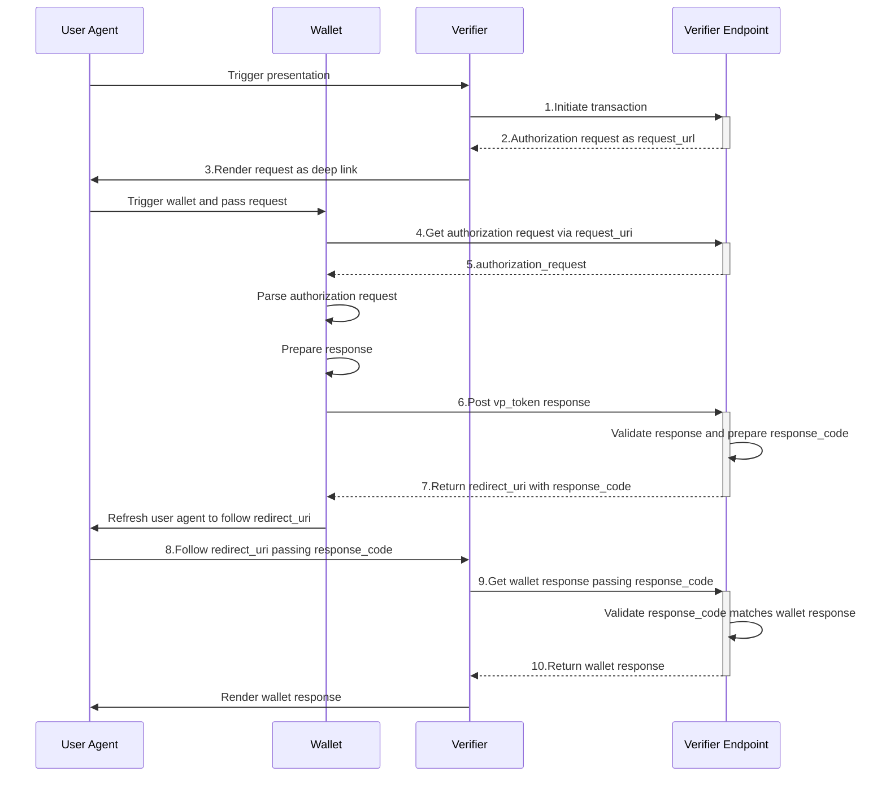

# Same Device Presentation Flows

## Sequence



## Request / Response  parameters

### 1.Initiate transaction

URL:https://verifier-backend.eudiw.dev/ui/presentaitions
Parameters:
```json
{
  "type": "vp_token",
  "presentation_definition": {
    "id": "32f54163-7166-48f1-93d8-ff217bdb0653",
    "input_descriptors": [
      {
        "id": "eu.europa.ec.eudi.pid.1",
        "name": "EUDI PID",
        "purpose": "We need to verify your identity",
        "format": {
          "mso_mdoc": {
            "alg": ["ES256", "ES384", "ES512", "EdDSA"]
          }
        },
        "constraints": {
          "fields": [
            {
              "path": ["$['eu.europa.ec.eudi.pid.1']['family_name']"],
              "intent_to_retain": false
            }
          ]
        }
      }
    ]
  },
  "nonce": "9b1271e7-f85b-43cd-8a66-2bfdaee1eeb2",
  "wallet_response_redirect_uri_template": "https://verifier.eudiw.dev/ get-wallet-code?response_code={RESPONSE_CODE}"
}
```


### 2.Authorization request as request_url

Parameters:
```json
{
  "presentation_id": "bhuYu_jQYVkvTMqQVcOIGIPWW5Jo_T4t3enUHz-RprTmvyJRAsTtfEn7OywGQLcWgIUql_bxKGmuWFpSXB9fwQ",
  "client_id": "verifier-backend.eudiw.dev",
  "request_uri": "https://verifier-backend.eudiw.dev/wallet/request.jwt/NVeIFA4rT0FRvXYwQ48re6b7RTH990rTrYSVAJhsCNqaaotM6XNQH8zMJMEN3rPKiJXw4xL7FRgkHzDaHytXfg"
}
```

### 3.Render request as deep link

URL: eudi-openid4vp://verifier-backend.eudiw.dev?client_id=verifier-backend.eudiw.dev&request_uri=https%3A%2F%2Fverifier-backend.eudiw.dev%2Fwallet%2Frequest.jwt%2FMU78l5jS6d2YwtNOiL5zXaLBJhX3MU59W6PO0T3pfp-SCLlnmtSE-hxaIZHDR7efq4S0rig9Riv4SNBCyE0llA

### 4.Get authorization request via request_uri 

URL: https://verifier-backend.eudiw.dev/wallet/request.jwt/{transactionId} （3.のクエリパラメータrequest_uriの値）

{transactionId}には以下のような値が指定される: 
- NVeIFA4rT0FRvXYwQ48re6b7RTH990rTrYSVAJhsCNqaaotM6XNQH8zMJMEN3rPKiJXw4xL7FRgkHzDaHytXf

### 5.authorization_request

Raw Parameters:
```text
eyJ4NWMiOlsiTUlJREtqQ0NBckNnQXdJQkFnSVVmeTl1NlNMdGdOdWY5UFhZYmgvUURxdVh6NTB3Q2dZSUtvWkl6ajBFQXdJd1hERWVNQndHQTFVRUF3d1ZVRWxFSUVsemMzVmxjaUJEUVNBdElGVlVJREF4TVMwd0t3WURWUVFLRENSRlZVUkpJRmRoYkd4bGRDQlNaV1psY21WdVkyVWdTVzF3YkdWdFpXNTBZWFJwYjI0eEN6QUpCZ05WQkFZVEFsVlVNQjRYRFRJME1ESXlOakF5TXpZek0xb1hEVEkyTURJeU5UQXlNell6TWxvd2FURWRNQnNHQTFVRUF3d1VSVlZFU1NCU1pXMXZkR1VnVm1WeWFXWnBaWEl4RERBS0JnTlZCQVVUQXpBd01URXRNQ3NHQTFVRUNnd2tSVlZFU1NCWFlXeHNaWFFnVW1WbVpYSmxibU5sSUVsdGNHeGxiV1Z1ZEdGMGFXOXVNUXN3Q1FZRFZRUUdFd0pWVkRCWk1CTUdCeXFHU000OUFnRUdDQ3FHU000OUF3RUhBMElBQk1iV0JBQzFHaitHRE8veUNTYmdiRndwaXZQWVdMekV2SUxOdGRDdjdUeDFFc3hQQ3hCcDNEWkI0RklyNEJsbVZZdEdhVWJvVklpaFJCaVFEbzNNcFdpamdnRkJNSUlCUFRBTUJnTlZIUk1CQWY4RUFqQUFNQjhHQTFVZEl3UVlNQmFBRkxOc3VKRVhITmVrR21ZeGgwTGhpOEJBekpVYk1DVUdBMVVkRVFRZU1CeUNHblpsY21sbWFXVnlMV0poWTJ0bGJtUXVaWFZrYVhjdVpHVjJNQklHQTFVZEpRUUxNQWtHQnlpQmpGMEZBUVl3UXdZRFZSMGZCRHd3T2pBNG9EYWdOSVl5YUhSMGNITTZMeTl3Y21Wd2NtOWtMbkJyYVM1bGRXUnBkeTVrWlhZdlkzSnNMM0JwWkY5RFFWOVZWRjh3TVM1amNtd3dIUVlEVlIwT0JCWUVGRmdtQWd1QlN2U25tNjhaem81SVN0SXYyZk0yTUE0R0ExVWREd0VCL3dRRUF3SUhnREJkQmdOVkhSSUVWakJVaGxKb2RIUndjem92TDJkcGRHaDFZaTVqYjIwdlpYVXRaR2xuYVhSaGJDMXBaR1Z1ZEdsMGVTMTNZV3hzWlhRdllYSmphR2wwWldOMGRYSmxMV0Z1WkMxeVpXWmxjbVZ1WTJVdFpuSmhiV1YzYjNKck1Bb0dDQ3FHU000OUJBTUNBMmdBTUdVQ01RREdmZ0xLbmJLaGlPVkYzeFNVMGFlanUvbmVHUVVWdU5ic1F3MExlRER3SVcrckxhdGViUmdvOWhNWERjM3dybFVDTUFJWnlKN2xSUlZleU1yM3dqcWtCRjJsOVliMHdPUXBzblpCQVZVQVB5STV4aFdYMlNBYXpvbTJKanNOL2FLQWtRPT0iLCJNSUlESFRDQ0FxT2dBd0lCQWdJVVZxamd0SnFmNGhVWUprcWRZemkrMHh3aHdGWXdDZ1lJS29aSXpqMEVBd013WERFZU1Cd0dBMVVFQXd3VlVFbEVJRWx6YzNWbGNpQkRRU0F0SUZWVUlEQXhNUzB3S3dZRFZRUUtEQ1JGVlVSSklGZGhiR3hsZENCU1pXWmxjbVZ1WTJVZ1NXMXdiR1Z0Wlc1MFlYUnBiMjR4Q3pBSkJnTlZCQVlUQWxWVU1CNFhEVEl6TURrd01URTRNelF4TjFvWERUTXlNVEV5TnpFNE16UXhObG93WERFZU1Cd0dBMVVFQXd3VlVFbEVJRWx6YzNWbGNpQkRRU0F0SUZWVUlEQXhNUzB3S3dZRFZRUUtEQ1JGVlVSSklGZGhiR3hsZENCU1pXWmxjbVZ1WTJVZ1NXMXdiR1Z0Wlc1MFlYUnBiMjR4Q3pBSkJnTlZCQVlUQWxWVU1IWXdFQVlIS29aSXpqMENBUVlGSzRFRUFDSURZZ0FFRmc1U2hmc3hwNVIvVUZJRUtTM0wyN2R3bkZobmpTZ1VoMmJ0S09RRW5mYjNkb3llcU1BdkJ0VU1sQ2xoc0YzdWVmS2luQ3cwOE5CMzFyd0MrZHRqNlgvTEUzbjJDOWpST0lVTjhQcm5sTFM1UXM0UnM0WlU1T0lnenRvYU84RzlvNElCSkRDQ0FTQXdFZ1lEVlIwVEFRSC9CQWd3QmdFQi93SUJBREFmQmdOVkhTTUVHREFXZ0JTemJMaVJGeHpYcEJwbU1ZZEM0WXZBUU15Vkd6QVdCZ05WSFNVQkFmOEVEREFLQmdncmdRSUNBQUFCQnpCREJnTlZIUjhFUERBNk1EaWdOcUEwaGpKb2RIUndjem92TDNCeVpYQnliMlF1Y0d0cExtVjFaR2wzTG1SbGRpOWpjbXd2Y0dsa1gwTkJYMVZVWHpBeExtTnliREFkQmdOVkhRNEVGZ1FVczJ5NGtSY2MxNlFhWmpHSFF1R0x3RURNbFJzd0RnWURWUjBQQVFIL0JBUURBZ0VHTUYwR0ExVWRFZ1JXTUZTR1VtaDBkSEJ6T2k4dloybDBhSFZpTG1OdmJTOWxkUzFrYVdkcGRHRnNMV2xrWlc1MGFYUjVMWGRoYkd4bGRDOWhjbU5vYVhSbFkzUjFjbVV0WVc1a0xYSmxabVZ5Wlc1alpTMW1jbUZ0WlhkdmNtc3dDZ1lJS29aSXpqMEVBd01EYUFBd1pRSXdhWFVBM2orK3hsL3RkRDc2dFhFV0Npa2ZNMUNhUno0dnpCQzdOUzB3Q2RJdEtpejZIWmVWOEVQdE5DbnNmS3BOQWpFQXFyZGVLRG5yNUt3ZjhCQTd0QVRlaHhObE9WNEhuYzEwWE8xWFVMdGlnQ3diNDlScGtxbFMySHVsK0RwcU9iVXMiXSwidHlwIjoib2F1dGgtYXV0aHotcmVxK2p3dCIsImFsZyI6IkVTMjU2In0.eyJyZXNwb25zZV91cmkiOiJodHRwczovL3ZlcmlmaWVyLWJhY2tlbmQuZXVkaXcuZGV2L3dhbGxldC9kaXJlY3RfcG9zdCIsImNsaWVudF9pZF9zY2hlbWUiOiJ4NTA5X3Nhbl9kbnMiLCJyZXNwb25zZV90eXBlIjoidnBfdG9rZW4iLCJub25jZSI6ImQ3OTkzNDdlLWE5ZWYtNDNhMi1hYTIwLWRkODA3MzlkNTMzZCIsImNsaWVudF9pZCI6InZlcmlmaWVyLWJhY2tlbmQuZXVkaXcuZGV2IiwicmVzcG9uc2VfbW9kZSI6ImRpcmVjdF9wb3N0Lmp3dCIsImF1ZCI6Imh0dHBzOi8vc2VsZi1pc3N1ZWQubWUvdjIiLCJzY29wZSI6IiIsInByZXNlbnRhdGlvbl9kZWZpbml0aW9uIjp7ImlkIjoiMzJmNTQxNjMtNzE2Ni00OGYxLTkzZDgtZmYyMTdiZGIwNjUzIiwiaW5wdXRfZGVzY3JpcHRvcnMiOlt7ImlkIjoiZXUuZXVyb3BhLmVjLmV1ZGkucGlkLjEiLCJuYW1lIjoiRVVESSBQSUQiLCJwdXJwb3NlIjoiV2UgbmVlZCB0byB2ZXJpZnkgeW91ciBpZGVudGl0eSIsImZvcm1hdCI6eyJtc29fbWRvYyI6eyJhbGciOlsiRVMyNTYiLCJFUzM4NCIsIkVTNTEyIiwiRWREU0EiLCJFU0IyNTYiLCJFU0IzMjAiLCJFU0IzODQiLCJFU0I1MTIiXX19LCJjb25zdHJhaW50cyI6eyJmaWVsZHMiOlt7InBhdGgiOlsiJFsnZXUuZXVyb3BhLmVjLmV1ZGkucGlkLjEnXVsnZmFtaWx5X25hbWUnXSJdLCJpbnRlbnRfdG9fcmV0YWluIjpmYWxzZX0seyJwYXRoIjpbIiRbJ2V1LmV1cm9wYS5lYy5ldWRpLnBpZC4xJ11bJ2dpdmVuX25hbWUnXSJdLCJpbnRlbnRfdG9fcmV0YWluIjpmYWxzZX0seyJwYXRoIjpbIiRbJ2V1LmV1cm9wYS5lYy5ldWRpLnBpZC4xJ11bJ2JpcnRoX2RhdGUnXSJdLCJpbnRlbnRfdG9fcmV0YWluIjpmYWxzZX0seyJwYXRoIjpbIiRbJ2V1LmV1cm9wYS5lYy5ldWRpLnBpZC4xJ11bJ2FnZV9vdmVyXzE4J10iXSwiaW50ZW50X3RvX3JldGFpbiI6ZmFsc2V9LHsicGF0aCI6WyIkWydldS5ldXJvcGEuZWMuZXVkaS5waWQuMSddWydhZ2VfaW5feWVhcnMnXSJdLCJpbnRlbnRfdG9fcmV0YWluIjpmYWxzZX0seyJwYXRoIjpbIiRbJ2V1LmV1cm9wYS5lYy5ldWRpLnBpZC4xJ11bJ2FnZV9iaXJ0aF95ZWFyJ10iXSwiaW50ZW50X3RvX3JldGFpbiI6ZmFsc2V9LHsicGF0aCI6WyIkWydldS5ldXJvcGEuZWMuZXVkaS5waWQuMSddWydmYW1pbHlfbmFtZV9iaXJ0aCddIl0sImludGVudF90b19yZXRhaW4iOmZhbHNlfSx7InBhdGgiOlsiJFsnZXUuZXVyb3BhLmVjLmV1ZGkucGlkLjEnXVsnZ2l2ZW5fbmFtZV9iaXJ0aCddIl0sImludGVudF90b19yZXRhaW4iOmZhbHNlfSx7InBhdGgiOlsiJFsnZXUuZXVyb3BhLmVjLmV1ZGkucGlkLjEnXVsnYmlydGhfcGxhY2UnXSJdLCJpbnRlbnRfdG9fcmV0YWluIjpmYWxzZX0seyJwYXRoIjpbIiRbJ2V1LmV1cm9wYS5lYy5ldWRpLnBpZC4xJ11bJ2JpcnRoX2NvdW50cnknXSJdLCJpbnRlbnRfdG9fcmV0YWluIjpmYWxzZX0seyJwYXRoIjpbIiRbJ2V1LmV1cm9wYS5lYy5ldWRpLnBpZC4xJ11bJ2JpcnRoX3N0YXRlJ10iXSwiaW50ZW50X3RvX3JldGFpbiI6ZmFsc2V9LHsicGF0aCI6WyIkWydldS5ldXJvcGEuZWMuZXVkaS5waWQuMSddWydiaXJ0aF9jaXR5J10iXSwiaW50ZW50X3RvX3JldGFpbiI6ZmFsc2V9LHsicGF0aCI6WyIkWydldS5ldXJvcGEuZWMuZXVkaS5waWQuMSddWydyZXNpZGVudF9hZGRyZXNzJ10iXSwiaW50ZW50X3RvX3JldGFpbiI6ZmFsc2V9LHsicGF0aCI6WyIkWydldS5ldXJvcGEuZWMuZXVkaS5waWQuMSddWydyZXNpZGVudF9jb3VudHJ5J10iXSwiaW50ZW50X3RvX3JldGFpbiI6ZmFsc2V9LHsicGF0aCI6WyIkWydldS5ldXJvcGEuZWMuZXVkaS5waWQuMSddWydyZXNpZGVudF9zdGF0ZSddIl0sImludGVudF90b19yZXRhaW4iOmZhbHNlfSx7InBhdGgiOlsiJFsnZXUuZXVyb3BhLmVjLmV1ZGkucGlkLjEnXVsncmVzaWRlbnRfY2l0eSddIl0sImludGVudF90b19yZXRhaW4iOmZhbHNlfSx7InBhdGgiOlsiJFsnZXUuZXVyb3BhLmVjLmV1ZGkucGlkLjEnXVsncmVzaWRlbnRfcG9zdGFsX2NvZGUnXSJdLCJpbnRlbnRfdG9fcmV0YWluIjpmYWxzZX0seyJwYXRoIjpbIiRbJ2V1LmV1cm9wYS5lYy5ldWRpLnBpZC4xJ11bJ3Jlc2lkZW50X3N0cmVldCddIl0sImludGVudF90b19yZXRhaW4iOmZhbHNlfSx7InBhdGgiOlsiJFsnZXUuZXVyb3BhLmVjLmV1ZGkucGlkLjEnXVsncmVzaWRlbnRfaG91c2VfbnVtYmVyJ10iXSwiaW50ZW50X3RvX3JldGFpbiI6ZmFsc2V9LHsicGF0aCI6WyIkWydldS5ldXJvcGEuZWMuZXVkaS5waWQuMSddWydnZW5kZXInXSJdLCJpbnRlbnRfdG9fcmV0YWluIjpmYWxzZX0seyJwYXRoIjpbIiRbJ2V1LmV1cm9wYS5lYy5ldWRpLnBpZC4xJ11bJ25hdGlvbmFsaXR5J10iXSwiaW50ZW50X3RvX3JldGFpbiI6ZmFsc2V9LHsicGF0aCI6WyIkWydldS5ldXJvcGEuZWMuZXVkaS5waWQuMSddWydpc3N1YW5jZV9kYXRlJ10iXSwiaW50ZW50X3RvX3JldGFpbiI6ZmFsc2V9LHsicGF0aCI6WyIkWydldS5ldXJvcGEuZWMuZXVkaS5waWQuMSddWydleHBpcnlfZGF0ZSddIl0sImludGVudF90b19yZXRhaW4iOmZhbHNlfSx7InBhdGgiOlsiJFsnZXUuZXVyb3BhLmVjLmV1ZGkucGlkLjEnXVsnaXNzdWluZ19hdXRob3JpdHknXSJdLCJpbnRlbnRfdG9fcmV0YWluIjpmYWxzZX0seyJwYXRoIjpbIiRbJ2V1LmV1cm9wYS5lYy5ldWRpLnBpZC4xJ11bJ2RvY3VtZW50X251bWJlciddIl0sImludGVudF90b19yZXRhaW4iOmZhbHNlfSx7InBhdGgiOlsiJFsnZXUuZXVyb3BhLmVjLmV1ZGkucGlkLjEnXVsnYWRtaW5pc3RyYXRpdmVfbnVtYmVyJ10iXSwiaW50ZW50X3RvX3JldGFpbiI6ZmFsc2V9LHsicGF0aCI6WyIkWydldS5ldXJvcGEuZWMuZXVkaS5waWQuMSddWydpc3N1aW5nX2NvdW50cnknXSJdLCJpbnRlbnRfdG9fcmV0YWluIjpmYWxzZX0seyJwYXRoIjpbIiRbJ2V1LmV1cm9wYS5lYy5ldWRpLnBpZC4xJ11bJ2lzc3VpbmdfanVyaXNkaWN0aW9uJ10iXSwiaW50ZW50X3RvX3JldGFpbiI6ZmFsc2V9XX19XX0sInN0YXRlIjoiWXY1dnp3SkdmakpZbVI5eGhwbjVkYlFPZFVCTUdpeDdMYllZSEI2VGFVRmJVc01ZblhnSGRoZ2Q4TUIxRkV6MWZ5aFVOVWMwemV5V1I5dHlxRFNRTnciLCJpYXQiOjE3MTk1Mzk1NjAsImNsaWVudF9tZXRhZGF0YSI6eyJhdXRob3JpemF0aW9uX2VuY3J5cHRlZF9yZXNwb25zZV9hbGciOiJFQ0RILUVTIiwiYXV0aG9yaXphdGlvbl9lbmNyeXB0ZWRfcmVzcG9uc2VfZW5jIjoiQTEyOENCQy1IUzI1NiIsImlkX3Rva2VuX2VuY3J5cHRlZF9yZXNwb25zZV9hbGciOiJSU0EtT0FFUC0yNTYiLCJpZF90b2tlbl9lbmNyeXB0ZWRfcmVzcG9uc2VfZW5jIjoiQTEyOENCQy1IUzI1NiIsImp3a3NfdXJpIjoiaHR0cHM6Ly92ZXJpZmllci1iYWNrZW5kLmV1ZGl3LmRldi93YWxsZXQvamFybS9ZdjV2endKR2ZqSlltUjl4aHBuNWRiUU9kVUJNR2l4N0xiWVlIQjZUYVVGYlVzTVluWGdIZGhnZDhNQjFGRXoxZnloVU5VYzB6ZXlXUjl0eXFEU1FOdy9qd2tzLmpzb24iLCJzdWJqZWN0X3N5bnRheF90eXBlc19zdXBwb3J0ZWQiOlsidXJuOmlldGY6cGFyYW1zOm9hdXRoOmp3ay10aHVtYnByaW50Il0sImlkX3Rva2VuX3NpZ25lZF9yZXNwb25zZV9hbGciOiJSUzI1NiJ9fQ.0yPSzBAtv54iSK3S5xwnqFvHZY5GUF78ytkfhiTmOXWsfJo94soSwvGS_LBme2Zoz_Nv9oGZNWUHnYFwWLcwEQ
```

Decoded Parameters:

Header
```json
{
  "x5c": [
    "MIIDKjCCArCgAwIBAgIUfy9u6SLtgNuf9PXYbh/QDquXz50wCgYIKoZIzj0EAwIwXDEeMBwGA1UEAwwVUElEIElzc3VlciBDQSAtIFVUIDAxMS0wKwYDVQQKDCRFVURJIFdhbGxldCBSZWZlcmVuY2UgSW1wbGVtZW50YXRpb24xCzAJBgNVBAYTAlVUMB4XDTI0MDIyNjAyMzYzM1oXDTI2MDIyNTAyMzYzMlowaTEdMBsGA1UEAwwURVVESSBSZW1vdGUgVmVyaWZpZXIxDDAKBgNVBAUTAzAwMTEtMCsGA1UECgwkRVVESSBXYWxsZXQgUmVmZXJlbmNlIEltcGxlbWVudGF0aW9uMQswCQYDVQQGEwJVVDBZMBMGByqGSM49AgEGCCqGSM49AwEHA0IABMbWBAC1Gj+GDO/yCSbgbFwpivPYWLzEvILNtdCv7Tx1EsxPCxBp3DZB4FIr4BlmVYtGaUboVIihRBiQDo3MpWijggFBMIIBPTAMBgNVHRMBAf8EAjAAMB8GA1UdIwQYMBaAFLNsuJEXHNekGmYxh0Lhi8BAzJUbMCUGA1UdEQQeMByCGnZlcmlmaWVyLWJhY2tlbmQuZXVkaXcuZGV2MBIGA1UdJQQLMAkGByiBjF0FAQYwQwYDVR0fBDwwOjA4oDagNIYyaHR0cHM6Ly9wcmVwcm9kLnBraS5ldWRpdy5kZXYvY3JsL3BpZF9DQV9VVF8wMS5jcmwwHQYDVR0OBBYEFFgmAguBSvSnm68Zzo5IStIv2fM2MA4GA1UdDwEB/wQEAwIHgDBdBgNVHRIEVjBUhlJodHRwczovL2dpdGh1Yi5jb20vZXUtZGlnaXRhbC1pZGVudGl0eS13YWxsZXQvYXJjaGl0ZWN0dXJlLWFuZC1yZWZlcmVuY2UtZnJhbWV3b3JrMAoGCCqGSM49BAMCA2gAMGUCMQDGfgLKnbKhiOVF3xSU0aeju/neGQUVuNbsQw0LeDDwIW+rLatebRgo9hMXDc3wrlUCMAIZyJ7lRRVeyMr3wjqkBF2l9Yb0wOQpsnZBAVUAPyI5xhWX2SAazom2JjsN/aKAkQ==",
    "MIIDHTCCAqOgAwIBAgIUVqjgtJqf4hUYJkqdYzi+0xwhwFYwCgYIKoZIzj0EAwMwXDEeMBwGA1UEAwwVUElEIElzc3VlciBDQSAtIFVUIDAxMS0wKwYDVQQKDCRFVURJIFdhbGxldCBSZWZlcmVuY2UgSW1wbGVtZW50YXRpb24xCzAJBgNVBAYTAlVUMB4XDTIzMDkwMTE4MzQxN1oXDTMyMTEyNzE4MzQxNlowXDEeMBwGA1UEAwwVUElEIElzc3VlciBDQSAtIFVUIDAxMS0wKwYDVQQKDCRFVURJIFdhbGxldCBSZWZlcmVuY2UgSW1wbGVtZW50YXRpb24xCzAJBgNVBAYTAlVUMHYwEAYHKoZIzj0CAQYFK4EEACIDYgAEFg5Shfsxp5R/UFIEKS3L27dwnFhnjSgUh2btKOQEnfb3doyeqMAvBtUMlClhsF3uefKinCw08NB31rwC+dtj6X/LE3n2C9jROIUN8PrnlLS5Qs4Rs4ZU5OIgztoaO8G9o4IBJDCCASAwEgYDVR0TAQH/BAgwBgEB/wIBADAfBgNVHSMEGDAWgBSzbLiRFxzXpBpmMYdC4YvAQMyVGzAWBgNVHSUBAf8EDDAKBggrgQICAAABBzBDBgNVHR8EPDA6MDigNqA0hjJodHRwczovL3ByZXByb2QucGtpLmV1ZGl3LmRldi9jcmwvcGlkX0NBX1VUXzAxLmNybDAdBgNVHQ4EFgQUs2y4kRcc16QaZjGHQuGLwEDMlRswDgYDVR0PAQH/BAQDAgEGMF0GA1UdEgRWMFSGUmh0dHBzOi8vZ2l0aHViLmNvbS9ldS1kaWdpdGFsLWlkZW50aXR5LXdhbGxldC9hcmNoaXRlY3R1cmUtYW5kLXJlZmVyZW5jZS1mcmFtZXdvcmswCgYIKoZIzj0EAwMDaAAwZQIwaXUA3j++xl/tdD76tXEWCikfM1CaRz4vzBC7NS0wCdItKiz6HZeV8EPtNCnsfKpNAjEAqrdeKDnr5Kwf8BA7tATehxNlOV4Hnc10XO1XULtigCwb49RpkqlS2Hul+DpqObUs"
  ],
  "typ": "oauth-authz-req+jwt",
  "alg": "ES256"
}
```

Payload
```json
{
  "response_uri": "https://verifier-backend.eudiw.dev/wallet/direct_post",
  "client_id_scheme": "x509_san_dns",
  "response_type": "vp_token",
  "nonce": "2d68e3ed-e06a-47af-8951-5c1e859e6fe1",
  "client_id": "verifier-backend.eudiw.dev",
  "response_mode": "direct_post.jwt",
  "aud": "https://self-issued.me/v2",
  "scope": "",
  "presentation_definition": {
    "id": "32f54163-7166-48f1-93d8-ff217bdb0653",
    "input_descriptors": [
      {
        "id": "eu.europa.ec.eudi.pid.1",
        "name": "EUDI PID",
        "purpose": "We need to verify your identity",
        "format": {
          "mso_mdoc": {
            "alg": ["ES256", "ES384", "ES512", "EdDSA"]
          }
        },
        "constraints": {
          "fields": [
            {
              "path": ["$['eu.europa.ec.eudi.pid.1']['family_name']"],
              "intent_to_retain": false
            }
          ]
        }
      }
    ]
  },
  "state": "mtvXUs46zYVCdFXXgqF_dHMjvcPKsj5MmmLozMRgU7kLE7_r1pMU2byeS3RAEOveomM_XCsPOzzKMctvXxRLpw",
  "iat": 1720413409,
  "client_metadata": {
    "authorization_encrypted_response_alg": "ECDH-ES",
    "authorization_encrypted_response_enc": "A128CBC-HS256",
    "id_token_encrypted_response_alg": "RSA-OAEP-256",
    "id_token_encrypted_response_enc": "A128CBC-HS256",
    "jwks_uri": "https://verifier-backend.eudiw.dev/wallet/jarm/mtvXUs46zYVCdFXXgqF_dHMjvcPKsj5MmmLozMRgU7kLE7_r1pMU2byeS3RAEOveomM_XCsPOzzKMctvXxRLpw/jwks.json",
    "subject_syntax_types_supported": ["urn:ietf:params:oauth:jwk-thumbprint"],
    "id_token_signed_response_alg": "RS256"
  }
}
```

### 6.Post vp_token response

URL: https://verifier-backend.eudiw.dev/wallet/direct_post
Parameters:
```json
{
  "state": "mtvXUs46zYVCdFXXgqF_dHMjvcPKsj5MmmLozMRgU7kLE7_r1pMU2byeS3RAEOveomM_XCsPOzzKMctvXxRLpw",
  "response": "eyJlcGsiOnsia3R5IjoiRUMiLCJ4IjoiNXk4eklmeFM5cnBtd0VuWk5ncmRhSGpZc2RHcVFweVV6NVJudjVEcEhZayIsInkiOiJIVFo0c1pfQzgybFM0V0tsSlB0WkR3SkJmTkVWUWVSMWFrY2VUWW5QeEVrIiwiY3J2IjoiUC0yNTYiLCJraWQiOiIxQzMyMzU5NS05NTkxLTQ1RUQtQUVDRC0zNEQ4NTlFQzFCMUQifSwia2lkIjoiY2M3OTc5ZTAtYWNkNy00YzRiLTk3OGYtYzEzMjZiMDNlNGQ3IiwiYXB2IjoiT0dReE1qWmlaVFV0TUdReFlpMDBPV0kzTFRrNE1USXRNV1l5TUdZNE1XSTNaalJpIiwiYWxnIjoiRUNESC1FUyIsImFwdSI6IlUzQkpiVmRUU3pCTmNrZERTMVpPWVhsbVIxZENkdyIsImVuYyI6IkExMjhDQkMtSFMyNTYifQ..FL8HI61FYc9bzSlRq0lngQ.sJ4wTHWjzvW1Jzt6DmuBvKupXqW-LliOOlsl3GjP9HS4KZ1PujS5L8u7XPly8t9FWPxKqvdaAJYR8IFZRUJDvdx6kftVoRMqAuKfRJAIfq-DhEyFKunUyxbqeyaNtfJqSBZO8in4JojpB54Dq9B-DCrKr9UgGzfurVexA50jaZxOECHFwXWVMbftvxzSTG_ITUfWVuWfY9V33z8s9E8mHjWM0hEXoicTzzMsITkNlKmGgqBNzsGtIiXShM61TEg6tAJcyVzEACYFp4gPUpvGX9tfBLcUiJc-p5UP1XJ9H56K86uls7ZevL5Cq8P_0hAfg-Q-BqhioYNcO_I-2vxqLC_-Qdz_55jAiFMnynB5RxOjOChFo0_leFK5qxMiLGS2bwV__k-bKFh59Y47-bJzo7ZstqdmUTAoAEk9LVZLJgiOqjWyjSaQvA4B4MrEfHu7msMv8WO8DPFYoUpGtNeY54K2RUvt41k7lmEQr-wusT0bIOoq8wm9EaPKPTmsn1twAezujoaOtG5-3KomScEXZH6YI2z6jCIrGZBImx195z_fxs0XdJHjTiwzMsK8Zn23SGIr0kfRwZ-vYDv1annntPnJKmF1XH67jzlyGbyy1JF4G3CknbFI87xukKRAkb9yeYhlODYv-5N_HYYhWULvA8wA_PRmezyZZtkWJ1m4uBdd29nftZxZ2SHRLJ-er3kLnM2pwBriC74QDZyWQAtK-DRZv4IGWKCWqA6S27FG0WZbLF8YJoK_dtegAI9AtW8FxoK_EA6tQoXuHzjZn3vY6jTDipgVIzPv85CHQQndriBjSHceRyC-l9ZwxCTg1XDEjfWloMfOC6yqxmvoYCOqdA2vvNP2B6Q_yJ-p85DXWeplm2LYSilVtEF7BW9_kYddbaFHaGYnWfEUQdz8LZZ5OFr0djwTt77p4MwyiJfZY4xS_rvZdJXERudVy29SkUYgwAW-8UZwUgL8eQ9Z1nDVzhw2-_WLmC6BVIAJ3_7INcs1A7k4u7-zfBqbdwYRI0BV-C24IGR1jMsYtlHCkQp2-v0u3U_sPks0r4wfcvzaGbB5A2BsON49tTF-qO99QbxvoR17KUVNYAFyLFGZnkyUF2vfmUc72qFzaVhMsNu2_rXuCgB6G8GlL5rCOf_5T3WaC3m2br9FPO2tX4cj-kHGTNNZGMjv0asCUvEhMm5oMiksEwcwoUfSHrkwTYqqYLQZRhhsYt5Wl5ZNIU81MtsZF60p320iiikJI0fZOMCzRZYhg40kFWwB_IXQbBXyVwft4uN3vtMUZRiBxtK2GBNaUyB7_bzscDxFpiOQyfW-B1AMauxWcR_OMAH6HGbME16ib-Q-fQN8RYg5HYWRkt91YSrO0MDiEvWfZMW6aB7IrkQ6XUgN04sPiYPMB1LYVrPWQ5eW_HjfE9Y4-Qxn8eNA1a6wfFTEJtzdUqMfPx87hp49Y8B-hkTZ5TUOSleeFKxgRnA0N6WL6ijt7ePqXPTUG3Vkq6zxVYlFJgPJ6X0jJRNIdN51GPYm6EP9BYPIsvjZzUUhA-2sqQ7nCu1ZmQNDQ4Hz1Ysb7EW7nYbIFdCg1Pa-sWaVCKnPs_zGdTnD0AvSQ4b-PaBVmBZJ9X13KZSijVZVQyTSweWGw7CMAtOl7LJEx6I0wp5enrvqEbhCXd9ToDbCV3dB4BtM2Shff2KqQySlCQZo_5xG57hJUtY3ff8fADetLtvVwXfVbke8m4i_VX6LODzsFHoxyL5COwZEPjRORMDEm4O5qwP4zjqd267RYX_1AqibeHIN-oKgfwdW-Zn38UWtCNVqJSpVIY04fhOnx4KwwAuSB2_5oMEm-L-uyuDhEcZVCjTxOnwyosAbFQ0tzDDa96_vdpevmO1sMj53l0Axa4D4PbMStyq5jmsgk_qZYdAbJPpXC1v1O1KA8_PY3O61drOQj65wa06QcdiRD58Hmpzoo2IhGoTsjyyvwdPEavvPczESJoFHPa2pluSH1BRQ1zizeXPkqfV0iyfZAxyKY2jMtGhADDrOYiu2-EjkAlNhYaKGxisdFrZGVgLPd1eIlKsBZGFGLPl99mPL3KVqtE7-p9DjazSdGvm0DT4YVpdM_3eFo4dd-OhCLCxObIo3JFJm88dw0Q2z5KjymW1rBNHTFvn9YKtDWD5ITUzZg5HOykSgg23hTHHHfCJmT7hVXjuiVzyjMLWrdjbGgJVAgl3UXng3G0l3XV25-TuuvKhqmw66iMXNo8N-2LADDMhEd11NoM1WMa_9cl6DPDzghuedoD4x1JZ3s17r0onR7JSdLqOI7GH5SOBfidmbnD0OY6Ei6iFjfEOB5qBrRHvTASjqJVbvuktKrwxxvFJLGai7hP_MW4xG6JGqG_eyze1lq5t9LDsUk1BRLhMEzFAzZwM5KRGSzm8rYo9VmvFMkjpOdb6KND89LFU890Uth1vTE-vN7Z7DVh_QvjFPCMQVj8DJxOSpygIQ12IFSn3J1vn6qealgW0iPn-AHNmeGKryHSPTor13TMq-LrihAZZ92xnxHZ5M-y98RzngCkJ0f2HScJ31_cQlJAK3ASCvjzp_81fb8Jz2Yx7oWjBpjN8JGmPBDBNHixKuhl5ol4fnuowKldOZcMYJaV6CVSbi1FNwdMNnmfvscW3tk5DHi9rXWXkCuIKvnJKvw3xaHg9DoaH3sMgFpp8ERAh1nBw9orCrKq1VNHbXiIHH_7DiPp5Mt18gA9GhwpJX2mxaeZU6cYNVh2QXWi5EGTKEe7ToQJVOfcpdE4J1gwMge1SxCCZPD-9Yk775Nd4yAFk1TICtSESSCE_dkuLHUxG1i1XH2Z_dUksPgVMcFfbZzUc9ZSzGmyeMx9OWR9JZ7MnqqYK-dlqwobFUWLHWLzDPKrOjjNI738UpbHyTSP2roVMq6U3bIhnxm9SNxudqqcPtMA4y4EDcAUeeOR1OaEmWI0RtR4FfuH14f7y5VzPKwqTv1LNUzKo8FBDZtN33ZH3w9myAqRRrtjdYONTXyF42_YpY3JxXi4_Dmhv9nfTCORuCKaAMrteXEgv7LG04pMtPgV9onRrPswFMrS0TBLW9cfFlZmBy5uMs6NSs87wrbLLCmy3p6PctCoHyLnhFOjO9Jv6O5E05cKSRCuZTBVN0v7PVR6TtTPcISyylC-KIVxCs_vu65Nu-bJ4oGDtWggqoTRXRQtc5U6CKaHYL34AtY-uf_HJbjlGzfggeBvoRGfg_t7cfK47mTbIxPLw_EJ7kNo32ss2Y4_hvLoxHYHdggXaSazQJ9RpiL-M4ezD1npmcANlG2HfKUXp5Al2gQuXfr-5wgIHW54wVRfr6mre2WaCZ3Z6BXZz1t88eVQhqEjBOEGXkx04Et1Ph6yN5kBTxa5lkCv354GSsJB6Lusy2hUIBQL0sy2RjvSgCBpi1nkROCdLcWX_-jP6jexMtcNReyCl7Bg8GOEPDAFEnekhm5siNc5ie4xmu1q795iObf4B8QDyfjuC6V7wrEskp7u6KkJxvNZA7DDxhWTinJDH_vQ1DiQ7w9ZYrOkZV3ZMLs7QwBfZdOmr-wpNxi17t7FJ_nS4PuIkHlOGDJHS8JM5InWkntifW6nH1nvRZ-D0yPnfbZm9UUmMgfGuSJvTa2p2Z99qcJDyAsk2-y3We0heShIJuyr_SBSlS_QkO_y-wE2A-xJOfkZ5DqkaKb9TciFTWMYG7yZyN0rHWE7LniwDB4gv21OT8dN5y_NYEbfl-lQZ1LUyErf7BNYJebJKU-RsJsA_e6o8Ye5PNJioHb7XGKxh6-xeCkpP6HiDUdiI9X0wplyb6L-npuFhRygynUlC10BFTx-FTgJiJZq0VMmiIeGdcHXzL16y9ji-Wq_zYQR6g25YFnV7KK2Q3Suy8Ep8iVxjO4srAh9mLk7GGWDT1IVn5ohojugWgy32jWG0ye_OuEU8_JWjbdxQWunzdi5aUNEAWqpXKny_RjZPtTr-tqU6NIzN8k_8Umc057Hbi4fWc8jZ8zK0r9V2CgBXe9BFCDlrdB7qclDfH24Jg5FsTMqeWvPYlM7m-7_sWy0caDSywqnQwRwMlKRX7X5O44tqwTRsXVDB7OXWrYZEQ72jI9lp9XkpXVUGif9ull5hHnWdTnCnS_fZOa1vMTaaW8B4Ki1CjsL0Q1pAtEKvT0HDJHd0F3gCySQpG7_wzUYbe6Yn7WxIfnOjR-O6GfPxKUmCMCPPBYjB2ihJof1NfhIKHlKPKTnazcT9702zguaHMgxVc3k4bm4dxzrYWCXxf-tMlD7lm8QhGojSO3_0TichH1KZv7O9-EMsrychxwpFJOn1Vrgx-chBCtUNa-J5TX6Nyo1-z2FYD5OprYCGvUZDboJvnKcd4Am-Y0iIxxwnplClSLJ0iCWTV9xMFP_YaQJAkLqq7MsU42m4PhHC7-B9JoxPRaiTJBNJAa3DEL6F3Ubrp7DYFPh77Z39VtOauw79Jy4QCVqJy56_OH-HDxUu2g9odJtjBfU23EeXHry1Nmk0-RdsnUQDtsHK5HBzFEU12ssYUaKmkrNbsEYCpANaKVpZol3GQCv07Hs490iylag1ndb3MPParLWCNAT0Z2hhbXH9UDrFVTtBJuUVoUc-cOczt8yQs4ZsGwpqZuVWmRlqK8oZ5xysbpxhmuaVFIs13iq8ysg4kM7zbyLyWJKruWpy4hnWvXZ8HlAw_ZSU117gTU11RFFBTZanwfx35jXGjtg5MgNB4pD-ahau4rZzorbrAGOK5ieDpLVz8GsFCxZoeCAPY_lxUUzFw9qx7scKAvQazE7zYPjFyjJiWUguJMd2jDP8LvMaITQyxaS5HI2kXBaUEamtiHfAFf-5V2U9HNSnt_pSP9rCr0KLEd-eAu7iMi6AxHbtv2NIbYdjPGHG-Hni6rliP9_5OBSUyvnrONcebb5wj0NGH0C6GmOYTymaZRs3KZoFCb22BRHKgQGJUITSblOOqAjyM4q9Q_RZLzUY8kOJGmJ9f84xnmosw0fUGOGfUix0qCdiU7E_CIXzqxiIuxKrmdo6A1SjqfGqZyelKVcolP99IXrn54gSxSd92N4LwJcU-pYlUtULQmD-6c1puJRgGS1GxdJyeQKDBPPbGwRdqRqf2A_hQUyBVDxuMN4JKkhGZ0DrsF2ziHA.dzFJRUqM5o3E3MS3D-BKpA"
}
```

### 7.Return redirect_uri with response_code

Parameters:
```json
{
  "redirect_uri": "https://verifier.eudiw.dev/get-wallet-code?response_code=a37b48e7-3abb-4149-8d0a-4695e44aa1b6"
}
```

### 8.Follow redirect_uri passing response_code

URL: https://verifier.eudiw.dev/get-wallet-code?response_code=a37b48e7-3abb-4149-8d0a-4695e44aa1b6

### 9.Get wallet response passing response_code 

URL: https://verifier-backend.eudiw.dev/ui/presentations/{presentation_id}?response_code=a37b48e7-3abb-4149-8d0a-4695e44aa1b6

※presentation_idには2.で受け取ったpresentation_idの値が入る。

### 10.Return wallet response

Parameters:
```json
{
  "vp_token": "o2d2ZXJzaW9uYzEuMGlkb2N1bWVudHOBo2dkb2NUeXBld2V1LmV1cm9wYS5lYy5ldWRpLnBpZC4xbGlzc3VlclNpZ25lZKJqbmFtZVNwYWNlc6F3ZXUuZXVyb3BhLmVjLmV1ZGkucGlkLjGB2BhYiqRmcmFuZG9tWEBD7IgWt8n1lLEwHYu-91-01KQXoYK26x23s5I_fXd1L9-fxA97HcJnQ28MNXW26FXz0aOzk4Hl6aGRjvQExih0aGRpZ2VzdElEGCxsZWxlbWVudFZhbHVlaUFOREVSU1NPTnFlbGVtZW50SWRlbnRpZmllcmtmYW1pbHlfbmFtZWppc3N1ZXJBdXRohEOhASahGCFZAoUwggKBMIICJqADAgECAgkWSuWZAtwFEGQwCgYIKoZIzj0EAwIwWDELMAkGA1UEBhMCQkUxHDAaBgNVBAoTE0V1cm9wZWFuIENvbW1pc3Npb24xKzApBgNVBAMTIkVVIERpZ2l0YWwgSWRlbnRpdHkgV2FsbGV0IFRlc3QgQ0EwHhcNMjMwNTMwMTIzMDAwWhcNMjQwNTI5MTIzMDAwWjBlMQswCQYDVQQGEwJCRTEcMBoGA1UEChMTRXVyb3BlYW4gQ29tbWlzc2lvbjE4MDYGA1UEAxMvRVUgRGlnaXRhbCBJZGVudGl0eSBXYWxsZXQgVGVzdCBEb2N1bWVudCBTaWduZXIwWTATBgcqhkjOPQIBBggqhkjOPQMBBwNCAAR8kxP0waSqTrCz62gRpJlOWd5nmWQxwvOuCI63oQYctli9jDkSbBlZeskN-Z0HjT7zkTujS9ssvGmH0Cfpr538o4HLMIHIMB0GA1UdDgQWBBTRpLEkOTL7RXJymUjyUn2VWKdNLTAfBgNVHSMEGDAWgBQykesOHAEdFA52T2xP6kyWONr7BDAOBgNVHQ8BAf8EBAMCB4AwEgYDVR0lBAswCQYHKIGMXQUBAjAfBgNVHRIEGDAWhhRodHRwOi8vd3d3LmV1ZGl3LmRldjBBBgNVHR8EOjA4MDagNKAyhjBodHRwczovL3N0YXRpYy5ldWRpdy5kZXYvcGtpL2NybC9pc28xODAxMy1kcy5jcmwwCgYIKoZIzj0EAwIDSQAwRgIhAN5fmOce9ldSEmvyxLhP3t-B0kPKV7Fb0xiqufHr6z99AiEA_iL3MmtLV1j_Fv6G0zqNjSmIIWnaBJtaXiyAarFHCEhZBd3YGFkF2KZndmVyc2lvbmMxLjBvZGlnZXN0QWxnb3JpdGhtZ1NIQS0yNTZnZG9jVHlwZXdldS5ldXJvcGEuZWMuZXVkaS5waWQuMWx2YWx1ZURpZ2VzdHOhd2V1LmV1cm9wYS5lYy5ldWRpLnBpZC4xuCEYLFggV2ONknxHwN4FoVdEd8GjXM4HaW4E2wPt73vQCLCpTBMYNFggUFmFI5nHQGp-vZBQcTZqSYYLYtmR1FGHF6Kz7b2W790DWCAj_BXrafhQOSCbHtXzohqjsVAtAOxx1oZD0NQ8e3_DxRgoWCAqRDwHCWVEMLbhKCo1cvL2JzaTg2N6pS6Ipm3GZeR9txggWCBffPOvq_Wxjje38IR95d2-6RH_tjMTkVrWPdW33P2yjRhoWCAW3wXTC21JNn9eJUu7VuxXit1WK7t_ao0A78Nx3i0NnxgtWCDhsjnHs1Tf2_pbLYipt4ccRjXU4QX34m0rPGquVXCmkRhnWCCrkRa2rzTbTRa9nGT-_CIgtkyGi0eYo2qPjeiC27dQeRg1WCDaWQTCwKL3bl4QUlmNJ2fh1FNRPDtFWMZB2RAomVWAdApYIFrYeR4oEM3NXQpaVSzB5lF8nKeGZjZx7loBFn1ulEuLGCJYICUEam92Dhe5ntfyz_gkan9VnfCjf5tPxoAqnc7hGMmhGDJYIJMjaK5SqQbpAhmL5YLTFUiadT8t9zaAi9A2946ukicnCFgg4X8d_gUmENWFBhgNeop9MuPqEPm-1HZOV_CHJmA008gYL1ggsPzL7nStO4QXsVBAZoPD1T3XIWwc7DAsFLwAMI68vdsFWCA86VOLSRG7fTBDHDuHa3K9asHt-c5k0toJPn5dD0_4ABgpWCBLaHpakefww77y4wFnwWKJ_V9NiUUoBirEOQ0ZndoHHhgfWCAbTkoCZOtyab2YhgBcrU2NtVkWXe7OukA4CB_BoXtklBghWCCHBuxK8zoqwnyZYwURrPJB_ku4ulJKRJFw4eQ8IS2_sxgjWCAhfUSVglAttIr9U-dqRVRykpvOgmm-z2CC3nl8fLjseRguWCABTrc6U40qvaFL8zZKfBV5nDm32v1wh_EkteZfDqi2bhgeWCCg5JTxcVku8wpK795qPUfVsc8nmJKl8aptjZyW58QTMQJYIH3KfNLaK9_gm2tkarVfK2Fd9UX0dyH4H1EofXZP_Ne5GCRYIJKpEhGniVmxePe72-7Ee3ImCKtpwkASaLGJr73DJXOkGDBYIGthxWet1WcTftfgIHT0rhwvlmxphIikec2AMQO57jSfGCdYIKBvQlRou9WaiTZK7xQbNjptRZPLm3xMPm3c-vUf5XxSCVggjYkqB_kU4TF3ZzmwF7Ur2C1cbIHyKsCgWZa7tBsu960YHFggsMYBwyDwIx2813pAi6XYxQsqES_OdRdaG93DRBhpd_AMWCDxUx_Rgae7pGAh7wORHS_MchpUT7awpGSo5bmxJwI_0wdYIC6slsqIGSTwaBWv73EtMNjREEM3ctvZiDeTIDPEp8mABlgga9Cak4sUk-bW2mF5p7yjvY6p6fDXnLVc8a-dqy5LvVIYK1ggD6dP4_y5Y9bqHQS-8UVx5OZNwagKmGO7WSVtzG5qfbgYJVggi-tGu93YTGId6e1bo4SkttFxyKCQIyeoDhbntMp-uB0YGlggz7MzWGILkS-jslJjIp8fsxNw2RNgHLyxuPEv0aZwVrJtZGV2aWNlS2V5SW5mb6FpZGV2aWNlS2V5pAECIAEhWCDyzK-j7XWDGfemlMR9Gr9umtz-c7BdSo5uJvRsXqnlDiJYIHI3OjcMWdNlED54AxG510DvGgEJfvbyFxNVUMQ0v1dfbHZhbGlkaXR5SW5mb6Nmc2lnbmVkwHQyMDI0LTA2LTE3VDA5OjM0OjEzWml2YWxpZEZyb23AdDIwMjQtMDYtMTdUMDk6MzQ6MTNaanZhbGlkVW50aWzAdDIwMjUtMDYtMTdUMDk6MzQ6MTNaWEDzgFgr10svScW9rIPmzHRWK52rngsy7-EF3g0XwFhL0ivs81e-Mqf5RkjdKrB1uw1Wzig1Q6y2ADX1CnwP8_ZabGRldmljZVNpZ25lZKJqbmFtZVNwYWNlc9gYQaBqZGV2aWNlQXV0aKFvZGV2aWNlU2lnbmF0dXJlhEOhASag9lhAG9DHpTeCRZ_TJpV7HDvLss4m-I3wNSp6WP6-a0HCcEHKUB1oUhcuUEVJFxe3QSms0OnFAPmvcTu57KGQ718TV2ZzdGF0dXMA",
  "presentation_submission": {
    "id": "84EE3B1B-7CEA-4F1B-B753-7C6B05F1CA75",
    "definition_id": "32f54163-7166-48f1-93d8-ff217bdb0653",
    "descriptor_map": [
      {
        "id": "eu.europa.ec.eudi.pid.1",
        "format": "mso_mdoc",
        "path": "$"
      }
    ]
  }
}
```

Decoded vp_token:
```cbor
{
  "version": "1.0",
  "documents": [
    {
      "docType": "eu.europa.ec.eudi.pid.1",
      "issuerSigned": {
        "nameSpaces": {
          "eu.europa.ec.eudi.pid.1": [
            24(<<
              {
                "random": h'43ec8816b7c9f594b1301d8bbef75fb4d4a417a182b6eb1db7b3923f7d77752fdf9fc40f7b1dc267436f0c3575b6e855f3d1a3b39381e5e9a1918ef404c62874',
                "digestID": 44,
                "elementValue": "ANDERSSON",
                "elementIdentifier": "family_name"
              }
            >>)
          ]
        },
        "issuerAuth": [
          h'a10126',
          {
            33: h'3082028130820226a0030201020209164ae59902dc051064300a06082a8648ce3d0403023058310b3009060355040613024245311c301a060355040a13134575726f7065616e20436f6d6d697373696f6e312b3029060355040313224555204469676974616c204964656e746974792057616c6c65742054657374204341301e170d3233303533303132333030305a170d3234303532393132333030305a3065310b3009060355040613024245311c301a060355040a13134575726f7065616e20436f6d6d697373696f6e313830360603550403132f4555204469676974616c204964656e746974792057616c6c6574205465737420446f63756d656e74205369676e65723059301306072a8648ce3d020106082a8648ce3d030107034200047c9313f4c1a4aa4eb0b3eb6811a4994e59de67996431c2f3ae088eb7a1061cb658bd8c39126c19597ac90df99d078d3ef3913ba34bdb2cbc6987d027e9af9dfca381cb3081c8301d0603551d0e04160414d1a4b1243932fb4572729948f2527d9558a74d2d301f0603551d230418301680143291eb0e1c011d140e764f6c4fea4c9638dafb04300e0603551d0f0101ff04040302078030120603551d25040b3009060728818c5d050102301f0603551d12041830168614687474703a2f2f7777772e65756469772e64657630410603551d1f043a30383036a034a032863068747470733a2f2f7374617469632e65756469772e6465762f706b692f63726c2f69736f31383031332d64732e63726c300a06082a8648ce3d0403020349003046022100de5f98e71ef65752126bf2c4b84fdedf81d243ca57b15bd318aab9f1ebeb3f7d022100fe22f7326b4b5758ff16fe86d33a8d8d29882169da049b5a5e2c806ab1470848'
          },
          h'd8185905d8a66776657273696f6e63312e306f646967657374416c676f726974686d675348412d32353667646f63547970657765752e6575726f70612e65632e657564692e7069642e316c76616c756544696765737473a17765752e6575726f70612e65632e657564692e7069642e31b821182c582057638d927c47c0de05a1574477c1a35cce07696e04db03edef7bd008b0a94c13183458205059852399c7406a7ebd905071366a49860b62d991d4518717a2b3edbd96efdd03582023fc15eb69f85039209b1ed5f3a21aa3b1502d00ec71d68643d0d43c7b7fc3c5182858202a443c0709654430b6e1282a3572f2f627369383637aa52e88a66dc665e47db7182058205f7cf3afabf5b18e37b7f0847de5ddbee911ffb63313915ad63dd5b7dcfdb28d1868582016df05d30b6d49367f5e254bbb56ec578add562bbb7f6a8d00efc371de2d0d9f182d5820e1b239c7b354dfdbfa5b2d88a9b7871c4635d4e105f7e26d2b3c6aae5570a69118675820ab9116b6af34db4d16bd9c64fefc2220b64c868b4798a36a8f8de882dbb7507918355820da5904c2c0a2f76e5e1052598d2767e1d453513c3b4558c641d91028995580740a58205ad8791e2810cdcd5d0a5a552cc1e6517c9ca786663671ee5a01167d6e944b8b1822582025046a6f760e17b99ed7f2cff8246a7f559df0a37f9b4fc6802a9dcee118c9a118325820932368ae52a906e902198be582d315489a753f2df736808bd036f78eae922727085820e17f1dfe052610d58506180d7a8a7d32e3ea10f9bed4764e57f087266034d3c8182f5820b0fccbee74ad3b8417b150406683c3d53dd7216c1cec302c14bc00308ebcbddb0558203ce9538b4911bb7d30431c3b876b72bd6ac1edf9ce64d2da093e7e5d0f4ff800182958204b687a5a91e7f0c3bef2e30167c16289fd5f4d894528062ac4390d199dda071e181f58201b4e4a0264eb7269bd9886005cad4d8db559165deeceba4038081fc1a17b6494182158208706ec4af33a2ac27c99630511acf241fe4bb8ba524a449170e1e43c212dbfb318235820217d449582502db48afd53e76a455472929bce8269becf6082de797c7cb8ec79182e5820014eb73a538d2abda14bf3364a7c15799c39b7dafd7087f124b5e65f0ea8b66e181e5820a0e494f171592ef30a4aefde6a3d47d5b1cf279892a5f1aa6d8d9c96e7c413310258207dca7cd2da2bdfe09b6b646ab55f2b615df545f47721f81f51287d764ffcd7b91824582092a91211a78959b178f7bbdbeec47b722608ab69c2401268b189afbdc32573a4183058206b61c567add567137ed7e02074f4ae1c2f966c698488a479cd803103b9ee349f18275820a06f425468bbd59a89364aef141b363a6d4593cb9b7c4c3e6ddcfaf51fe57c520958208d892a07f914e131776739b017b52bd82d5c6c81f22ac0a05996bbb41b2ef7ad181c5820b0c601c320f0231dbcd77a408ba5d8c50b2a112fce75175a1bddc344186977f00c5820f1531fd181a7bba46021ef03911d2fcc721a544fb6b0a464a8e5b9b127023fd30758202eac96ca881924f06815afef712d30d8d110433772dbd98837932033c4a7c9800658206bd09a938b1493e6d6da6179a7bca3bd8ea9e9f0d79cb55cf1af9dab2e4bbd52182b58200fa74fe3fcb963d6ea1d04bef14571e4e64dc1a80a9863bb59256dcc6e6a7db8182558208beb46bbddd84c621de9ed5ba384a4b6d171c8a0902327a80e16e7b4ca7eb81d181a5820cfb33358620b912fa3b25263229f1fb31370d913601cbcb1b8f12fd1a67056b26d6465766963654b6579496e666fa1696465766963654b6579a401022001215820f2ccafa3ed758319f7a694c47d1abf6e9adcfe73b05d4a8e6e26f46c5ea9e50e22582072373a370c59d365103e780311b9d740ef1a01097ef6f217135550c434bf575f6c76616c6964697479496e666fa3667369676e6564c074323032342d30362d31375430393a33343a31335a6976616c696446726f6dc074323032342d30362d31375430393a33343a31335a6a76616c6964556e74696cc074323032352d30362d31375430393a33343a31335a',
          h'f380582bd74b2f49c5bdac83e6cc74562b9dab9e0b32efe105de0d17c0584bd22becf357be32a7f94648dd2ab075bb0d56ce283543acb60035f50a7c0ff3f65a'
        ]
      },
      "deviceSigned": {
        "nameSpaces": 24(<<
          {
          }
        >>),
        "deviceAuth": {
          "deviceSignature": [
            h'a10126',
            {
            },
            null,
            h'1bd0c7a53782459fd326957b1c3bcbb2ce26f88df0352a7a58febe6b41c27041ca501d6852172e5045491717b74129acd0e9c500f9af713bb9eca190ef5f1357'
          ]
        }
      }
    }
  ],
  "status": 0
}
```
